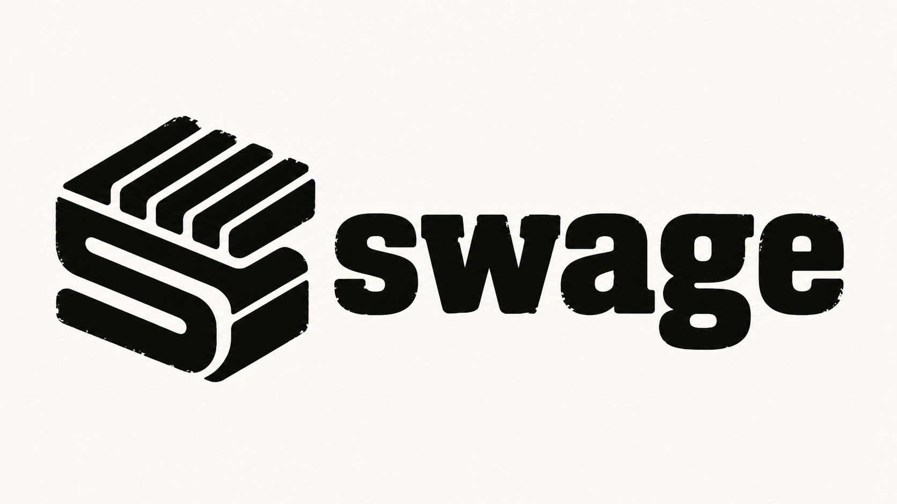

<!-- README.md -->

<p align="center">
  
</p>

# Swage

[](https://github.com/abhiksark/swage/actions/workflows/ci-python.yml)
[](https://github.com/abhiksark/swage/actions/workflows/ci-cpp.yml)
[](https://github.com/abhiksark/swage/actions/workflows/ci-gpu.yml)

**Turn variable-sized dense segments into efficient GPU tile tasks.**

Swage is an experimental Python-embedded GPU compiler built on MLIR and
LLVM. You write a Triton-like kernel that describes what happens to *one
logical segment*; Swage is designed to derive fixed-size GPU tile tasks and
generate NVIDIA GPU code through MLIR, LLVM, and NVPTX.

> **Status: pre-alpha, M8 internal split-CTA qualification complete.** The
> canonical fixed vector-add kernel remains the public execution subset. Internal
> segmented sum, max, and stable ragged-softmax modules lower to a sequential
> CPU oracle and one CTA per segment on NVIDIA GPUs. For one canonical identity
> segmented sum, private M7 and M8 paths run direct warp/CTA work and split
> oversized segments into partial and merge CTAs. Public segment syntax and
> public segmented launch remain planned. See
> [Current status](#current-status) for the exact boundary.

## The programming model

The executable fixed-block vector-add subset is deliberately Triton-like. It
infers its narrow ABI from PyTorch CUDA tensors and Python integers (`n` maps
to `sl.int32`):

```python
import swage as sw
import swage.language as sl
import torch


@sw.jit
def add_kernel(x_ptr, y_ptr, output_ptr, n, BLOCK: sl.constexpr):
    pid = sl.program_id(0)
    offsets = pid * BLOCK + sl.arange(0, BLOCK)
    mask = offsets < n
    x = sl.load(x_ptr + offsets, mask=mask, other=0.0)
    y = sl.load(y_ptr + offsets, mask=mask, other=0.0)
    sl.store(output_ptr + offsets, x + y, mask=mask)


length = 1024
block = 128
x = torch.randn(length, device="cuda", dtype=torch.float32)
y = torch.randn(length, device="cuda", dtype=torch.float32)
output = torch.empty_like(x)
add_kernel.launch(
    arguments={
        "x_ptr": x,
        "y_ptr": y,
        "output_ptr": output,
        "n": length,
    },
    constexprs={"BLOCK": block},
    grid=((length + block - 1) // block,),
)
torch.testing.assert_close(output, x + y)
```

The PyPI wheel installs the importable `swage` package. It does not contain
the native `mlir_swage` package or compiler build output. Both `launch()` and
`emit_mlir()` require a bindings-enabled native build and its build-tree
`mlir_swage` package. Install the optional PyTorch dependency with
`pip install "swage-compiler[pytorch]"`. `launch()` is keyword-only,
asynchronous, returns `None`, and uses the current PyTorch CUDA stream.
`emit_mlir()` remains compile-only, and its explicit `signature=` form
remains available without PyTorch. Direct kernel calls remain unavailable.
PTX emission is an internal runtime operation, not a public API.

The research target is the segment API: one segment-local program, from
which the compiler derives packing, bucketing, partitioning, partial
reductions, and static or persistent scheduling as the runtime
segment-length distribution changes:

```python
@sw.jit
def segmented_softmax(values_ptr, offsets_ptr, output_ptr):
    sid = sl.segment_id(0)
    segment = sl.segment(values_ptr, offsets_ptr, sid)

    x = sl.load_segment(segment)
    maximum = sl.max(x)
    numerator = sl.exp(x - maximum)
    denominator = sl.sum(numerator)

    sl.store_segment(output_ptr, segment, numerator / denominator)
```

## Architecture

```text
Python @sw.jit kernel
        │  restricted Python AST
        ▼
Swage semantic MLIR
        ├── M3 fixed vector add → gpu / nvvm / LLVM IR
        │                        → PTX → CUDA Driver API
        │                        → current PyTorch stream
        ├── M4 segmented sum/max → sequential scf/memref CPU oracle
        │                         → one CTA per segment → NVPTX
        ├── M5 ragged softmax → max → exponential sum → normalize/store
        │                      → internal CPU and one-CTA GPU qualification
        ├── M6 identity segmented sum → SwagePlan classify
        ├── M7 private materialization → stable warp/CTA task IDs
        │                              → one fused mixed GPU kernel
        └── M8 private split path → ordered CTA chunks up to 4096 elements
                                  → partial scratch sums → merge CTAs
```

The three-level vocabulary is load-bearing: a **segment** is a logical,
runtime-sized, internally dense data object; a **task** is a schedulable
unit of execution; a **tile** is a fixed-size physical unit processed by a
warp or CTA. See
[docs/concepts/segments-tiles-tasks.md](docs/concepts/segments-tiles-tasks.md).

## Current status

| Stage | State |
|---|---|
| `swage` MLIR dialect (`!swage.segment<T>`, `segment_id`, `make_segment`, `extent`) | **Works today**: parses, prints, verifies; lit-tested |
| Pinned out-of-tree LLVM/MLIR build (`llvmorg-22.1.8`) + `swage-opt` | **Works today** |
| `python -m swage.env` environment diagnostics | **Works today** |
| Native `mlir_swage` bindings package | **Works today** from the build tree; integration-tested |
| Python AST → verified live `mlir_swage.ir.Module` (fixed-block vector add, inferred or explicit signature) | **Works today**; `emit_mlir()` remains compile-only |
| Fixed vector add lowering through LLVM NVPTX to deterministic PTX | **Works today, internal**; native-tested for exact targets |
| CUDA Driver launch, cache, and real GPU result | **Works today for the public M3 subset**; trusted A6000 GPU workflow |
| Native segmented sum/max lowering | **Works today for canonical internal qualification modules**; upstream `mlir-runner` CPU oracle and one-CTA `sm_86` tests |
| Native stable ragged-softmax lowering | **Works today for the canonical internal qualification module**; max, exponential-sum, and normalization/store phases match PyTorch and the CPU oracle on RTX A6000 `sm_86` |
| `swage_plan` policy attribute, task-range type, classify operation, and `--swage-to-plan` | **Works today, internal** for one canonical identity segmented sum; the semantic function is preserved and unsupported inputs fail before mutation |
| Internal host task descriptor generation | **Works today, unit-tested** for validated i32 metadata; emits direct warp/CTA descriptors or ordered split-CTA chunks and compact merge descriptors |
| Internal M7/M8 planned segmented-sum execution | **Works today for canonical qualification only**; pure controls execute every segment, direct mixed work retains the M7 one-launch path, and oversized segments use private 128-thread partial and merge kernels |
| Public segment frontend and segmented launch, including ragged softmax | Planned |
| Packed warps, queues, persistent scheduling, and broader policies | Planned for later milestones |

The M5 differential suite covers all-empty, all-singleton, many-tiny,
few-huge, one-outlier, and alternating-empty segment distributions. The
runner is internal: it retains the five-argument values, offsets, output,
value-count, and segment-count ABI, validates host-visible metadata, and does
not widen `swage.language`, `emit_mlir()`, or public `launch()`.

The M6 planning conversion admits only the capture-free, map-free,
single-stage identity segmented sum. It adds a private planning companion
that records warp then CTA as the legal policy order. M7 privately clones the
semantic module, runs that conversion, reads the recorded threshold, and
classifies validated runtime metadata into stable warp and CTA segment-ID
lists. Pure policies use the same task-ID ABI. Mixed execution uses one
128-thread kernel with four one-segment warp slots per warp block followed by
one block per CTA task.

M8 keeps warp and CTA as the complete policy list and adds private task
decomposition for segments longer than 4096 elements. The classifier emits
ordered absolute input chunks followed by one compact scratch-range merge per
split segment. Mixed execution launches direct work, all partial CTAs, then all
merge CTAs on the same current stream. The exact and nontrivial f32 suites pass
against PyTorch and the CPU oracle on NVIDIA RTX A6000 `sm_86`. This is a
correctness qualification only; the frozen M7 benchmark and its `1.05` gate
are unchanged.

The frozen `bimodal` benchmark on NVIDIA RTX A6000 `sm_86` measured medians of
`0.067584 ms` for pure warp, `0.070656 ms` for pure CTA, and `0.063488 ms` for
mixed execution. Its mixed-to-best-pure ratio is `0.939394`, passing the
predeclared maximum of `1.05`. This qualifies only the private canonical
identity-sum path. It does not add public segment syntax or public segmented
execution.

The research question: *can one segment-local program automatically produce
competitive warp, CTA, split-CTA, and persistent schedules as the runtime
segment-length distribution changes?* Swage did not invent ragged tensors,
segmented reductions, persistent kernels, or tile programming; the intended
contribution is the automatic derivation of the schedule from one
segment-local kernel.

## Getting started

```bash
# CPU-only: build the pinned LLVM/MLIR (once, ~1 hour), then Swage
./scripts/fetch_llvm.sh
./scripts/build_llvm.sh
./scripts/build_swage.sh        # builds swage-opt and runs the lit suite

# Python package and tests
make setup
make test
```

The native bindings require the pinned LLVM/MLIR install with its Python
bindings enabled. Run `ninja -C build check-swage-python` after the native
build; it sets the build-tree `PYTHONPATH` for `mlir_swage`. On Linux with
PyTorch CUDA and `libcuda`, the M3 subset can then compile and launch the
fixed vector add. The internal native suite also qualifies M4 segmented sum
and max plus M5 ragged softmax. The public launch path has no CUDA toolkit
dependency.

See the [runnable M3 walkthrough](docs/quickstart.md#execute-fixed-vector-add).
A GPU is not required for the CPU and compile-only development paths.

## More

- [DESIGN.md](DESIGN.md): architecture and design invariants
- [ROADMAP.md](ROADMAP.md): phased plan and honest phase status
- [CONTRIBUTING.md](CONTRIBUTING.md): contributor paths, CPU-only onboarding
- [docs/adr/](docs/adr/): architecture decision records

## License

MIT. See [LICENSE](LICENSE).
