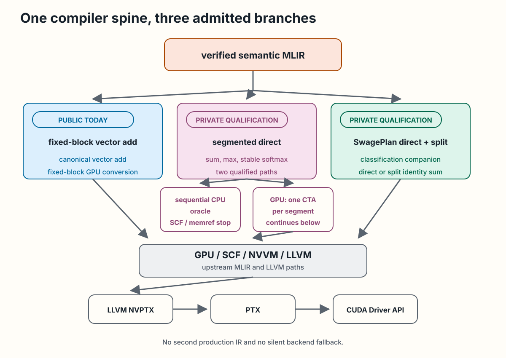
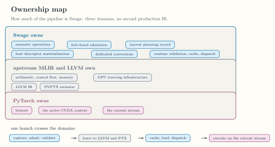

<!-- docs/architecture/compiler-pipeline.md -->

# Compiler Pipeline

Swage has one canonical compiler spine. Python source or native test IR
becomes verified semantic MLIR, then an admitted lowering branch uses upstream
MLIR and LLVM infrastructure. There is no second production IR between Python
and MLIR.

Verified semantic MLIR enters one of three admitted branches. Public M3 uses
the fixed-block conversion for canonical vector add. Private M4 and M5 use
direct segmented lowering to the sequential CPU oracle or one-CTA GPU path.
Private M6 to M8 adds the narrow `SwagePlan` classification companion for
direct or split identity-sum lowering. GPU branches rejoin upstream GPU, SCF,
NVVM, and LLVM lowering before LLVM NVPTX emits PTX for the CUDA Driver API.
No branch introduces a second production IR or a silent backend fallback.

*The implemented compiler spine and its public and private branches. [Open the full-size figure](../assets/diagrams/compiler-pipeline.svg).*

## Frontend boundary

`@swage.jit` captures source without executing the body. The frontend parses
a restricted Python AST and constructs a live `mlir_swage.ir.Module` directly
through MLIR Python bindings. The module preserves source locations and must
verify before it crosses the frontend boundary.

The exact accepted source forms live in [Kernel Language](../reference/kernel-language.md).
The compile-only and execution call contracts live in
[Public Python API](../reference/public-python-api.md).

## Semantic MLIR boundary

The `swage` dialect represents logical fixed-block and segment semantics.
Runtime segment identity is carried by SSA values, not types. Region-based
maps and reductions remain symbolic until an admitted lowering handles them.
Ordinary arithmetic, loops, buffers, and backend operations use upstream
dialects.

[Swage Dialect](../reference/swage-dialect.md) owns the current operation and
type surface. [SwagePlan Dialect](../reference/swage-plan-dialect.md) owns the
small private planning surface.

## Public M3 branch

The fixed-block conversion admits only the canonical vector-add form. It maps
each vector lane to one GPU x-thread, lowers through upstream GPU, SCF, NVVM,
and LLVM infrastructure, and emits PTX in process with LLVM NVPTX. The public
runtime launches that result through the CUDA Driver API.

No `nvgpu` dialect conversion is part of this implemented branch. Runtime
specialization, cache, module loading, stream, and retention behavior live in
[Runtime and Environment](../reference/runtime-environment.md).

## Private M4 and M5 branches

Canonical segmented sum, max, and stable ragged-softmax modules enter through
native qualification, not the public Python frontend. One conversion creates
a sequential CPU correctness oracle. Another creates one CTA per segment and
continues through upstream GPU, NVVM, LLVM, and NVPTX stages.

Exact admitted module shapes and internal ABIs live only in
[Private M4 to M8 Qualification](../qualification/private-m4-m8.md).

## Private M6 to M8 branch

For one canonical identity segmented sum, admission can add a private planning
companion without mutating the semantic function. Validated host metadata is
then classified and materialized into direct IDs or split records. Private
lowering factories produce the direct, partial, and merge kernels used by the
qualification runtime.

This branch implements narrow rule-based classification and M8 task
decomposition. It does not implement general cost inference, general schedule
selection, packing, queues, or persistent scheduling.

## Ownership boundary

Swage currently owns semantic operations, fail-closed admission, the narrow
planning record, host descriptor materialization, and the dedicated
conversions required by qualified paths. Upstream MLIR and LLVM own ordinary
arithmetic, control flow, memory operations, GPU lowering infrastructure,
LLVM IR, and NVPTX emission. PyTorch owns tensors, the active CUDA context,
and the current stream.

*What Swage owns against upstream MLIR and LLVM and PyTorch. [Open the full-size figure](../assets/figures/ownership-map.svg).*

Continue with [Compiler Tools and Passes](../reference/compiler-tools.md) for
the command-line surface, or [Verification Evidence](../qualification/evidence.md)
to audit the executable gates for each branch.
