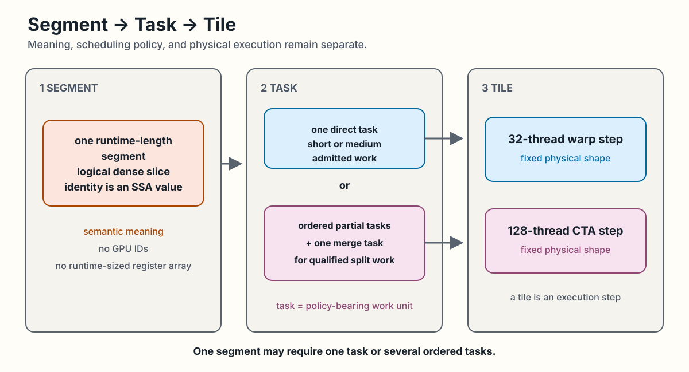

<!-- docs/concepts/segments-tiles-tasks.md -->

# Segments, Tasks, and Tiles

Swage keeps program meaning, schedulable work, and physical execution
separate. The order matters: begin with the segment, derive tasks, then map
each task to a fixed hardware step.

One runtime-length segment retains its logical dense meaning. Qualification
may derive one direct task or several ordered partial tasks plus a merge task;
the task is the policy-bearing work unit. Each task executes through a fixed
32-thread warp or 128-thread CTA step. The execution shape is not a
runtime-sized register array, and it does not change the segment's meaning.

<div class="doc-figure" tabindex="0" markdown="1">



</div>

*Segment meaning, task policy, and fixed execution shape stay distinct. [Open the full-size figure](../assets/diagrams/segments-tasks-tiles.svg).*

## Segment: the semantic unit

A segment is one logical, runtime-sized, internally dense slice:

```text
segment i = values[offsets[i] : offsets[i + 1]]
```

Segment lengths are runtime values. They may be zero and may differ greatly
within one batch. In native IR, `!swage.segment<f32>` carries only the element
type. The values buffer, offsets buffer, and segment index remain SSA
operands. A runtime-sized segment is never represented as a runtime-sized
register array.

The semantic program uses logical coordinates. GPU thread and block IDs do
not appear in the `swage` dialect.

## Task: the schedulable bridge

A task is a unit that a runtime can schedule for a segment. One semantic
segment may require one task or several tasks. A task can represent direct
work, a chunk of a long segment, a partial result, or a merge.

Current private M8 identity-sum qualification derives:

- one direct warp task for a segment of at most 32 elements;
- one direct CTA task for a segment from 33 through 4096 elements;
- ordered partial CTA tasks plus one merge CTA task for a longer segment.

The thresholds are configurable planning limits. Split work is current only
for the private canonical identity sum. Packing several short segments,
split max, split softmax, device queues, and persistent scheduling are future
work.

## Tile: the physical step

A tile is the fixed physical work shape used while lowering a task. In the
current qualified identity-sum paths, a warp step uses 32 threads, a CTA
step uses 128 threads, and a split partial or merge step uses 512 threads.
The 4096-element CTA chunk limit is the number of input
elements traversed by a task, not the number of threads.

Some design records use forms such as `tile<32xf32>` as conceptual notation.
There is no current `tile` type or operation in the Swage dialect. Native
lowering uses upstream fixed-shape and GPU constructs after semantic
admission.

## Logical and physical grids

The logical grid identifies semantic program instances. The physical grid
contains the GPU work that is actually launched. Keeping the grids separate
allows a future planner to change task structure without changing program
meaning.

The current public Python path uses a logical fixed-block coordinate for
canonical vector add. The private segmented path proves selected Segment to
Task to Tile mappings. It does not yet provide a public general planner.

Carry this distinction into [Compiler Pipeline](../architecture/compiler-pipeline.md),
which shows where semantic IR branches into current lowering paths. Exact
private task and ABI details live in [Private Qualification](../qualification/private-m4-m8.md).
