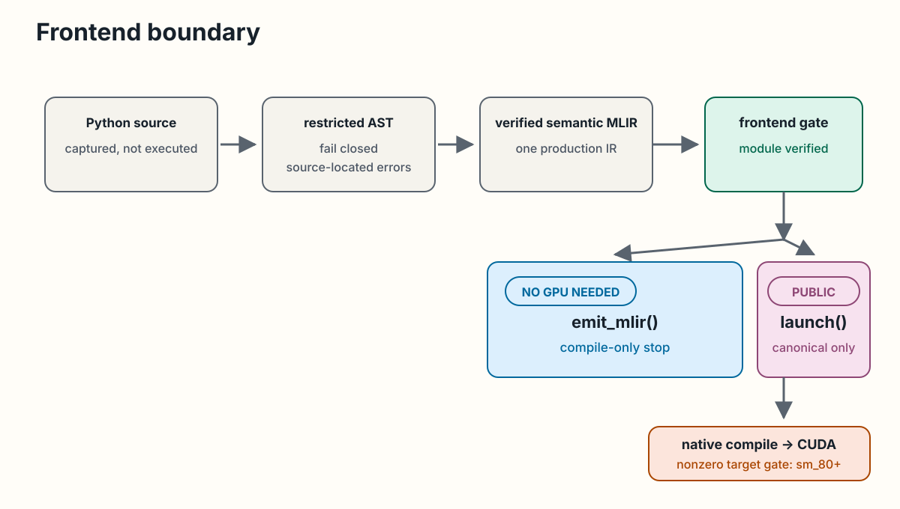

<!-- docs/getting-started/quickstart.md -->

# Quickstart

This walkthrough exercises the supported public fixed vector-add path. The
compile-only and CPU test paths work without a GPU. CUDA execution requires
the native build, CUDA-enabled PyTorch, an NVIDIA GPU, and the installed CUDA
driver. The example launches nonzero work. Exact target-admission and zero-work
rules live in
[Runtime and Environment](../reference/runtime-environment.md).

Python source crosses a restricted AST validation boundary before becoming
verified semantic MLIR. From that point, `emit_mlir()` stops with a
compile-only module and needs no GPU. The canonical `launch()` path continues
through native compilation to CUDA.

<div class="doc-figure" tabindex="0" markdown="1">



</div>

*The verified frontend boundary and its two public outcomes. [Open the full-size figure](../assets/diagrams/frontend-boundary.svg).*

## Prepare the checkout

Follow [Installation](installation.md) to install the Python
package and build the pinned LLVM/MLIR toolchain plus Swage.

Confirm the environment and fast Python tier:

```bash
python -m swage.env
PYTHONPATH="$PWD/python" python -m pytest tests/python -q
```

Confirm the native compiler and bindings:

```bash
ninja -C build check-swage
ninja -C build check-swage-python
```

## Inspect the semantic dialect

`swage-opt` can parse, verify, and print a test module:

```bash
./build/bin/swage-opt test/Dialect/Swage/roundtrip.mlir
```

This is a native MLIR surface. It is broader than the current public Python
kernel language. See [Swage Dialect](../internals/swage-dialect.md) for that
boundary.

## Execute fixed vector add

The committed
[`examples/fixed_vector_add.py`](https://github.com/abhiksark/swage/blob/main/examples/fixed_vector_add.py)
contains the supported kernel, compile-only emission, launch, and result
check.

Use an isolated directory for cache and debug artifacts:

```bash
export SWAGE_WALKTHROUGH_DIR="$(mktemp -d)"
export SWAGE_CACHE_DIR="$SWAGE_WALKTHROUGH_DIR/cache"
export SWAGE_DUMP_DIR="$SWAGE_WALKTHROUGH_DIR/dumps"
export SWAGE_DUMP_MLIR=1
export SWAGE_DUMP_PTX=1

PYTHONPATH=build/python_packages python examples/fixed_vector_add.py
```

The example prints verified semantic MLIR, launches asynchronously, and
checks the output against PyTorch. Inspect the requested compiler artifacts:

```bash
find "$SWAGE_DUMP_DIR" -maxdepth 1 -type f -print
sed -n '1,120p' "$SWAGE_DUMP_DIR"/*.mlir
sed -n '1,80p' "$SWAGE_DUMP_DIR"/*.ptx
```

On an identified clean checkout with its LLVM pin, run the example a second
time to exercise persistent-cache verification and reuse. A dirty or
unidentified build instead reuses compiled work only within the current
process. The exact call contract is in
[Public Python API](../reference/swage.md), and the cache and stream
rules are in
[Runtime and Environment](../reference/runtime-environment.md).

## Continue

- Read [Kernel Language](../reference/kernel-language.md) before changing the
  Python kernel.
- Read [Compiler Pipeline](../internals/compiler-pipeline.md) before changing
  native lowering.
- Use [Troubleshooting](troubleshooting.md) when a package,
  binding, tool, or CUDA component cannot be found.
