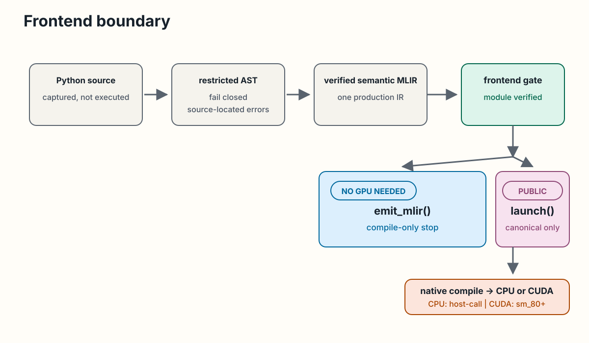

<!-- docs/getting-started/quickstart.md -->

# Quickstart

This tutorial takes a canonical fixed vector-add kernel from source capture
to a verified result on an explicitly selected CPU or CUDA backend. It uses
the v0.5.2 native-wheel contract, whose publication and release qualification
are still pending; see [Installation](installation.md) for release-candidate
and source-build options. The committed
[`examples/fixed_vector_add.py`](https://github.com/abhiksark/swage/blob/main/examples/fixed_vector_add.py)
contains this walkthrough as one runnable script, using metadata inference
in place of the explicit signature. The parallel
[`examples/fixed_vector_multiply.py`](https://github.com/abhiksark/swage/blob/main/examples/fixed_vector_multiply.py)
uses the same ABI with `x * y`.

Python source crosses a restricted AST validation boundary before becoming
verified semantic MLIR. From that point, `emit_mlir()` stops with a
compile-only module and needs no GPU. The canonical `launch()` path
continues through native compilation to the selected backend. Fixed-kernel
semantics are unchanged by native packaging.

<div class="doc-figure" tabindex="0" markdown="1">



</div>

*The verified frontend boundary and its two public outcomes. [Open the full-size figure](../assets/diagrams/frontend-boundary.svg).*

## Prerequisites

Follow [Installation](installation.md) to install a native wheel and a suitable
PyTorch build. No source checkout or local LLVM tree is needed to use the
wheel. Check the environment and choose one backend:

```bash
python -m swage.env --json --check native
python -m swage.env --json --check cpu
# Run this check if selecting CUDA:
python -m swage.env --json --check cuda
```

CPU works without a GPU. CUDA needs a CUDA-enabled PyTorch build and an
admitted device and driver; the release gate targets A6000/`sm_86`, not every
admitted GPU. See the [support matrix](../reference/runtime-environment.md#support-matrix).
Only source-build users need to set `PYTHONPATH=build/python_packages`.

Save the Python snippets below together in a `.py` file so `@sw.jit` can read
the kernel's source; do not define the kernel only at an interactive prompt.

## Write the kernel

A Swage kernel is ordinary-looking Python that is captured, never
executed. The decorator reads the source and returns a kernel object;
the body is validated against the restricted kernel language when the
kernel is emitted or launched:

```python
import swage as sw
import swage.language as sl

@sw.jit
def add_kernel(x_ptr, y_ptr, output_ptr, n, BLOCK: sl.constexpr):
    """Add two vectors elementwise under a bounds mask."""
    pid = sl.program_id(0)
    offsets = pid * BLOCK + sl.arange(0, BLOCK)
    mask = offsets < n
    x = sl.load(x_ptr + offsets, mask=mask, other=0.0)
    y = sl.load(y_ptr + offsets, mask=mask, other=0.0)
    sl.store(output_ptr + offsets, x + y, mask=mask)
```

Each program instance owns one block of `BLOCK` lanes: `program_id(0)`
names the block, `arange(0, BLOCK)` spreads its lanes, and the mask
retires lanes at or beyond `n`. The kernel is not directly callable;
calling it raises. The accepted source forms are listed in
[Kernel Language](../reference/kernel-language.md).

Changing only the stored value to `x * y` selects multiplication. The public
subset accepts exactly one `x + y` or `x * y`; it does not accept operation
chains, floating vector/scalar arithmetic, broadcasting, or matrix
multiplication.

## Emit and read the MLIR

`emit_mlir()` uses the native bindings included in the wheel. It needs no GPU
and no PyTorch when the signature is explicit (wheel-only tier):

```python
module = add_kernel.emit_mlir(
    signature={
        "x_ptr": sl.pointer(sl.float32),
        "y_ptr": sl.pointer(sl.float32),
        "output_ptr": sl.pointer(sl.float32),
        "n": sl.int32,
    },
    constexprs={"BLOCK": 128},
)
print(module)
```

The printed module is verified semantic MLIR: one function carrying the
logical `swage.program_id` operation surrounded by ordinary `arith` and
`vector` operations, with source locations preserved. Nothing has touched
a GPU yet.

## Launch on CPU or CUDA

Arguments are passed by name, `BLOCK` stays a compile-time value, and the
grid must cover `n`. Start with an explicit CPU selection:

```python
import torch

backend = "cpu"  # Choose "cuda" explicitly to run on CUDA instead.
n, block = 1025, 128
x = torch.randn(n, device=backend, dtype=torch.float32)
y = torch.randn(n, device=backend, dtype=torch.float32)
output = torch.empty_like(x)

add_kernel.launch(
    arguments={"x_ptr": x, "y_ptr": y, "output_ptr": output, "n": n},
    constexprs={"BLOCK": block},
    grid=((n + block - 1) // block,),
    backend=backend,
)
if backend == "cuda":
    torch.cuda.synchronize()
torch.testing.assert_close(output, torch.add(x, y), rtol=0, atol=0)
```

The launch validates its complete host-visible boundary first and compiles
in process. CPU execution completes before return; CUDA enqueues
asynchronously on the current PyTorch stream, so this example synchronizes
before checking the result. The API default remains CUDA, but examples choose
explicitly. Failure on one backend never attempts the other. The exact rules
live in [Runtime and Environment](../reference/runtime-environment.md).

From a checkout containing the committed example, using the installed wheel:

```bash
python examples/fixed_vector_add.py --backend cpu
python examples/fixed_vector_add.py --backend cuda
python examples/fixed_vector_add.py --backend cpu --dtype float16
python examples/fixed_vector_add.py --backend cuda --dtype float8_e4m3fn
python examples/fixed_vector_add.py --backend cuda --dtype float8_e5m2
python examples/fixed_vector_multiply.py --backend cpu
python examples/fixed_vector_multiply.py --backend cuda --dtype float8_e4m3fn
```

Choose the backend and dtype to exercise. `--dtype` defaults to `float32`;
all four dtypes work on either backend. The example explicitly creates
low-precision inputs by casting generated FP32 data and checks the result
against the selected FP32 operation rounded back to that dtype. Swage itself
never casts or moves tensor storage. The example source is not needed by the installed
runtime; outside a checkout, download the linked script and run it with
the same options.

## Inspect compiler artifacts

Use an isolated directory for cache and debug artifacts, then run the
committed example with dumps enabled (CUDA GPU tier):

```bash
export SWAGE_WALKTHROUGH_DIR="$(mktemp -d)"
export SWAGE_CACHE_DIR="$SWAGE_WALKTHROUGH_DIR/cache"
export SWAGE_DUMP_DIR="$SWAGE_WALKTHROUGH_DIR/dumps"
export SWAGE_DUMP_MLIR=1
export SWAGE_DUMP_PTX=1

python examples/fixed_vector_add.py --backend cuda
find "$SWAGE_DUMP_DIR" -maxdepth 1 -type f -print
```

The dump directory receives the lowered MLIR and emitted PTX, named by
specialization digest. A wheel with validated clean build metadata permits
persistent CUDA cache reuse in a second process. Source builds use an
identified clean checkout and LLVM pin when packaged metadata is absent.
Dirty, unidentified, or malformed identity permits only process-local reuse;
malformed metadata is also reported in `native.error`. See
[native build identity](../reference/runtime-environment.md#native-build-identity).

For value-free cache and launch diagnostics, configure logging in your
application before launching:

```python
import logging

logging.basicConfig(level=logging.WARNING)
logging.getLogger("swage.runtime").setLevel(logging.DEBUG)
```

Swage installs no handlers and is silent by default. DEBUG records report
cache outcomes and backend launch events, not tensors, pointers, PTX, or cache
paths. Debug dumps above are separate, explicit writes of compiler artifacts;
do not publish them as though they were sanitized logs.

## Where next

Continue with the [User Guide](../user-guide/index.md) for the ideas
behind the kernel, the [swage API reference](../reference/swage.md) for
the exact call contracts, or
[Troubleshooting](troubleshooting.md) when a package, binding, tool, or
CUDA component cannot be found.
