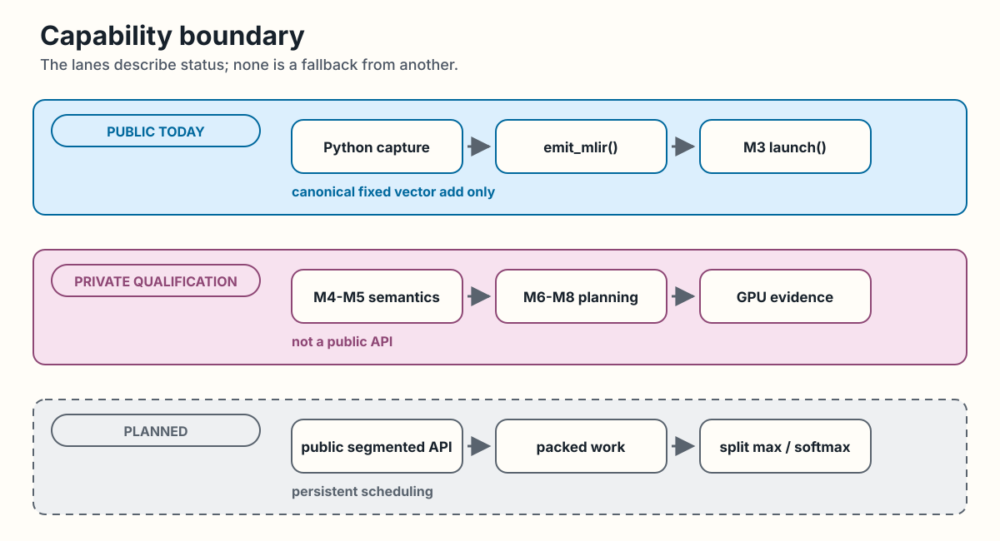

<!-- docs/index.md -->

# Swage

Swage is an experimental Python-embedded MLIR/LLVM GPU compiler. Its public
execution boundary is one canonical fixed vector-add kernel. The wider
segment compiler exists as private qualification machinery or planned work,
not as public segmented Python syntax.

!!! warning "Pre-alpha boundary"

    Read status labels literally. Public today is supported application
    surface. Private qualification is tested contributor machinery. Planned
    describes work that has not passed a public gate.

## Public today

- The pure Python `swage` package, distributed as `swage-compiler`.
- `@swage.jit` capture and compile-only `emit_mlir()` for the restricted
  fixed-block vector-add subset, when build-tree native bindings are present.
- Keyword-only CUDA launch for the canonical fixed vector add.
- `python -m swage.env` environment diagnostics.
- Native `swage` MLIR parsing, verification, and registered compiler tools.

The published wheel does not include the native `mlir_swage` package or
compiler build output. Native wheel packaging remains deferred.

## Private qualification

- Segmented sum and max through a sequential CPU oracle and one CTA per
  segment on NVIDIA GPUs.
- Stable ragged softmax through the same private CPU and one-CTA GPU
  boundary.
- Canonical identity-sum planning, direct warp and CTA execution,
  fused mixed execution, and split-CTA partial and merge execution.

These paths have tests and recorded qualification evidence. They do not widen
the public Python language or launch contract.

## Planned

- Public segment syntax and public segmented launch.
- Packing several short segments into one warp allocation.
- Split max and split softmax.
- Device queues, persistent scheduling, and broader policy selection.

The three lanes below are status boundaries, not fallback paths. Public today
contains Python capture, compile-only `emit_mlir()`, and the canonical
fixed vector-add `launch()`. Private qualification contains the tested
segmented compiler and runtime evidence, but it is not a public API. Planned
work contains a public segmented API, packed work, split max and softmax, and
persistent scheduling.

*Swage capability status at a glance. [Open the full-size figure](assets/diagrams/capability-boundary.svg).*

## Choose a path

| Goal | Start here |
|---|---|
| Install or run the supported example | [Installation](getting-started/installation.md), then [Quickstart](getting-started/quickstart.md) |
| Learn the segment model | [Swage, Visually](user-guide/ragged-data.md), then [Segments, Tasks, and Tiles](user-guide/execution-model.md) |
| Contribute to the compiler | [Compiler Pipeline](internals/compiler-pipeline.md), [Compiler Tools and Passes](internals/compiler-tools.md), and [Contributing](https://github.com/abhiksark/swage/blob/main/CONTRIBUTING.md) |
| Audit qualification claims | [Internals](internals/index.md) and [Verification Evidence](internals/verification.md) |

For exact public call contracts, use [Public Python API](reference/swage.md).
For the rationale behind a boundary, use the [ADR Index](decisions/index.md).
