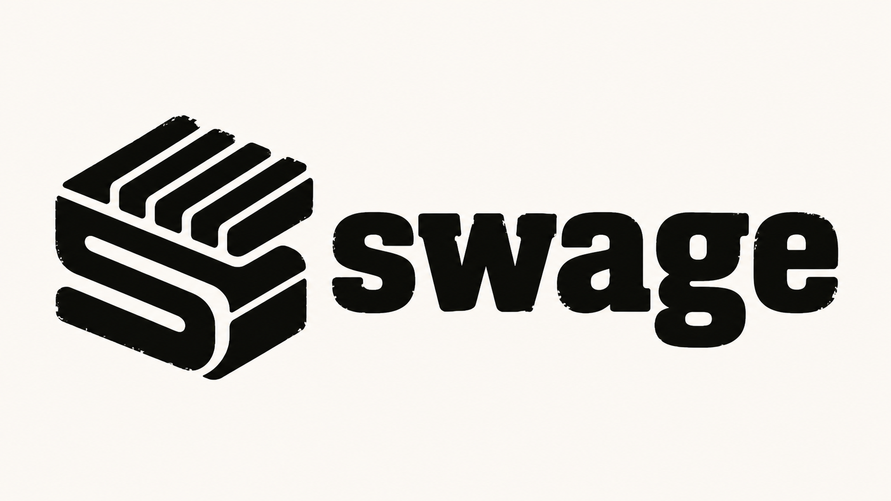
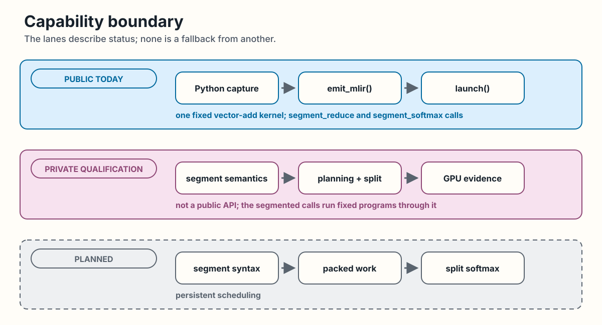

<!-- docs/index.md -->

# Swage

Swage is an experimental Python-embedded MLIR/LLVM GPU compiler. It studies
how one segment-local program can keep its meaning while task derivation
changes with runtime segment lengths.

Segments are usable from Python through two calls with fixed programs:
`swage.segment_reduce` for a sum, a maximum, a minimum, or a mean per
segment, and
`swage.segment_softmax` for a softmax within each segment. There is no
public segment syntax, and the kernel language compiles one canonical fixed
vector-add kernel. The wider segment compiler exists as private
qualification machinery or planned work.

!!! warning "Pre-alpha boundary"

    Read status labels literally. Public today is supported application
    surface. Private qualification is tested contributor machinery. Planned
    describes work that has not passed a public gate.

## Public today

- The pure Python `swage` package, distributed as `swage-compiler`. On its
  own it captures a kernel and checks it against the kernel language.
- Compile-only `emit_mlir()` for the restricted fixed-block vector-add
  subset, when build-tree native bindings are present.
- Keyword-only CUDA launch for the canonical fixed vector add.
- `swage.segment_reduce` for `"sum"`, `"max"`, `"min"`, and `"mean"`, and
  `swage.segment_softmax`, over int32 or int64 offsets on one CUDA device,
  when build-tree native bindings are present. Both take values of rank
  one or of rank two, `[N, D]` rows that are reduced or normalized per
  column. A reduction takes f32 or f64 values, and the softmax takes f32
  values. The calls admit
  no other dtype, kind, or rank, and prepare their offsets on the host at
  every call. Both record a gradient for values that require grad.
  [Segmented Calls](user-guide/segmented-calls.md) states the contract and
  the cost.
- `python -m swage.compile`, which writes the kernels of those two calls
  ahead of time, and `SWAGE_ARTIFACT_DIR`, which makes a process run the
  calls from such a directory without the native bindings.
  [Running Without the Compiler](user-guide/deployment.md) states what
  that delivers and what it does not.
- `python -m swage.env` environment diagnostics.
- Native `swage` MLIR parsing, verification, and registered compiler tools.

The published wheel does not include the native `mlir_swage` package or
compiler build output. Native wheel packaging remains deferred. These pages
describe the current source tree, and
[Installation](getting-started/installation.md) lists what the released
`0.5.1` wheel lacks, which includes the two segmented calls.

## Private qualification

- Segmented sum, max, and min through a sequential CPU oracle and one CTA per
  segment on NVIDIA GPUs.
- Stable ragged softmax through the same private CPU and one-CTA GPU
  boundary.
- Planning, direct warp and CTA execution, fused mixed execution, and
  split-CTA partial and merge execution for capture-free, single-stage
  sum, max, and min programs over f32 or f64 values.

These paths have tests and recorded qualification evidence. The two
segmented calls run a fixed sum, max, and softmax through them with default
limits. Other programs, the prepared launches, the scheduling policies, and
the planning limits stay private, and none of it widens the public kernel
language or the `launch()` contract.

## Planned

- Public segment syntax, and public launch of a segment program that the
  caller writes.
- Packing several short segments into one warp allocation.
- Split softmax.
- Device queues, persistent scheduling, and broader policy selection. One
  persistent queue exists as a private experiment whose predeclared
  performance gate failed.

The three lanes are status boundaries, not fallback paths.

*Swage capability status at a glance. [Open the full-size figure](assets/diagrams/capability-boundary.svg).*

## Choose a path

-   **Getting started**

    ---

    Install the package, build the pinned toolchain, and run the
    supported example end to end.

    [Installation](getting-started/installation.md)

-   **User guide**

    ---

    The ideas behind Swage: ragged data, writing and launching kernels,
    and the execution model.

    [Start the guide](user-guide/index.md)

-   **API reference**

    ---

    Exact public contracts for the package, the kernel language, and
    the runtime.

    [Open the reference](reference/index.md)

-   **Internals**

    ---

    The compiler and runtime machinery behind the public surface, with
    its qualification evidence.

    [Read the internals](internals/index.md)

Continue with [Installation](getting-started/installation.md). For the
rationale behind a boundary, use the [ADR index](decisions/index.md);
for the exact public call surface, use [swage](reference/swage.md).
