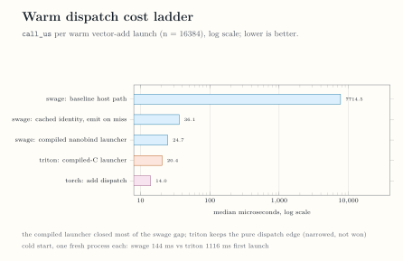

<!-- docs/internals/benchmarks.md -->

# Benchmarks

!!! warning "Recorded evidence"

    This page reports recorded measurements from one benchmark campaign
    on one machine. It is not a continuously enforced gate and not a
    public performance contract.

## Environment and provenance

All numbers were recorded on 2026-08-27 on an NVIDIA GeForce RTX 5090
(`sm_120`), driver 580.173.02, CUDA 13.0, PyTorch 2.13.0+cu130, and
Triton 3.7.1, on a co-tenant GPU. The committed snapshot
[`benchmarks/results/perf-5090-sm120.json`](https://github.com/abhiksark/swage/blob/main/benchmarks/results/perf-5090-sm120.json)
records the aggregated medians, quartiles, and per-number provenance.
Each value is the median of three independent process runs unless its
provenance field states otherwise. The Triton baseline is the tuned
per-segment kernel, the best of the swept and autotuned configurations,
not the naive one.

## Timing methods

Three timing methods separate host dispatch cost from kernel quality:

- `call_us` is the synchronized wall clock per call, what a plain
  Python loop pays;
- `kernel_us` places CUDA events around 32 back-to-back launches, so
  the host launcher stays visible for short kernels;
- `graph_us` replays the same 32 launches from a captured CUDA graph,
  removing the host and isolating kernel quality.

*How each timing method sees dispatch and kernel time. [Open the full-size figure](../assets/figures/timing-methods.svg).*

## Segmented sum under graph timing

Under graph replay, the best Swage policy per distribution beats
`torch.segment_reduce` on all seven distributions and the tuned Triton
baseline on six of seven. The uniform-4k row is parity, nominally
Triton (2.5 versus Swage's 2.6 microseconds). The bimodal and few-huge Swage
bars time one captured mixed sequence, the planner's fused warp launch
plus the 512-thread split kernels; their provenance fields in the
snapshot record the single-sequence caveat.

*Segmented sum graph-replay medians per distribution; lower is better. [Open the full-size figure](../assets/figures/segsum-graph-comparison.svg).*

## Dispatch cost

The campaign reduced warm per-launch dispatch from 7714.5 to 36.1
microseconds by caching the compiler identity and skipping emission on
cache hits, then to 24.7 microseconds through the compiled nanobind
launcher. Triton's compiled-C launcher measures 20.4 microseconds and
torch dispatch about 14, so pure dispatch narrowed but was not won.
Cold start went the other way: the first vector-add launch in a fresh
process took 144 milliseconds for Swage against 1116 milliseconds for
Triton's autotuning stack.

*The warm dispatch ladder and the cold-start comparison. [Open the full-size figure](../assets/figures/dispatch-ladder.svg).*

## Honest losses

- Pure warm dispatch stays with Triton (20.4 versus 24.7 microseconds)
  and torch (about 14).
- uniform-4k segmented sum is parity, nominally Triton (2.5 versus
  2.6 microseconds).
- Vector add under graph timing shows two stable Swage losses to
  Triton: n = 2^18 (1.38 versus 1.19 microseconds, about 16 percent)
  and n = 2^20 (3.17 versus 2.49, about 27 percent); torch also leads
  Swage at both sizes. The other measured sizes are within a few
  percent, including an 8 percent Swage edge at n = 2^16 that stays
  below the snapshot's win bar of at least 10 percent over the best
  baseline. The snapshot records the full sweep; Swage claims no
  vector-add win.

Continue with [Verification](verification.md) for the executable
proof behind each boundary, or [Task Execution](task-execution.md) for
the execution contracts these measurements exercise.
