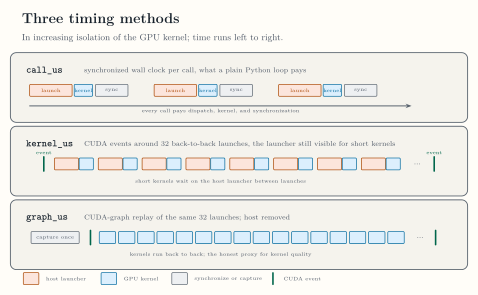
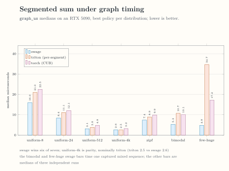
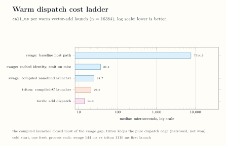

<!-- docs/internals/benchmarks.md -->

# Benchmarks

!!! warning "Recorded evidence"

    This page reports recorded measurements from three campaigns, each on
    one machine. None is a continuously enforced gate, and none is a public
    performance contract.

The page reads in the order the records were made. Each section says which
record it reports, and the last record is the only one that describes the
kernels the compiler generates now.

| Record | Date | GPU | What it measures |
|---|---|---|---|
| [`perf-5090-sm120.json`](https://github.com/abhiksark/swage/blob/main/benchmarks/results/perf-5090-sm120.json) | 2026-08-27 | RTX 5090 (`sm_120`) | One frozen layout per row against `torch.segment_reduce` and a Triton kernel that reads one block per segment; dispatch cost; vector add |
| [`persistent-sum-a6000-sm86.json`](https://github.com/abhiksark/swage/blob/main/benchmarks/results/persistent-sum-a6000-sm86.json) | 2026-09-02 | RTX A6000 (`sm_86`) | The predeclared persistent gate against static mixed execution |
| [`segmented-sum-a6000-sm86-453c56e`](https://github.com/abhiksark/swage/blob/main/benchmarks/results/segmented-sum-a6000-sm86-453c56e.md) | 2026-10-02 | RTX A6000 (`sm_86`) | A new offsets layout on every call, and one frozen layout per row against looped and planned Triton, five processes each |

The first two records were made before kernels passed through the LLVM pass
pipeline and with earlier revisions of the harnesses. The third was made at
revision `453c56e` with the harnesses that
[Harness methods](#harness-methods) describes. One more record, the first
Swage and Triton comparison on the A6000 at revision `80f222d`, is reported
on the [A6000 comparison study](a6000-comparison.md) beside the third.

## The RTX 5090 snapshot

The numbers in this section, in [Segmented sum under graph timing](#segmented-sum-under-graph-timing),
and in [Dispatch cost](#dispatch-cost) were recorded on
2026-08-27 on an NVIDIA GeForce RTX 5090 (`sm_120`), driver 580.173.02,
CUDA 13.0, PyTorch 2.13.0+cu130, and Triton 3.7.1, on a co-tenant GPU. The
committed snapshot
[`benchmarks/results/perf-5090-sm120.json`](https://github.com/abhiksark/swage/blob/main/benchmarks/results/perf-5090-sm120.json)
records the aggregated medians, quartiles, and per-number provenance.
Each value is the median of three independent process runs unless its
provenance field states otherwise. The Triton baseline of this snapshot is a
per-segment kernel that reads one block per segment, at the best of the
swept and autotuned configurations. The snapshot holds no looped and no
planned Triton baseline and no measurement with changing offsets.

Every timing describes the PTX that the source revision of its record
generated. The revisions of this snapshot and of the persistent gate emitted
PTX without the LLVM pass pipeline that kernels go through now (see
[Compiler Pipeline](compiler-pipeline.md)), so their numbers do not measure
currently generated code. The `453c56e` record does.

## Timing methods

Three timing methods separate host dispatch cost from kernel quality:

- `call_us` is the synchronized wall clock per call, what a plain
  Python loop pays;
- `kernel_us` places CUDA events around 32 back-to-back launches, so
  the host launcher stays visible for short kernels;
- `graph_us` replays the same 32 launches from a captured CUDA graph,
  removing the host and isolating kernel quality.

<div class="doc-figure" tabindex="0" markdown="1">



</div>

*How each timing method sees dispatch and kernel time. [Open the full-size figure](../assets/figures/timing-methods.svg).*

## Segmented sum under graph timing

This section reports the RTX 5090 snapshot. Under graph replay, with one
frozen layout per row, the best Swage policy per distribution is faster than
`torch.segment_reduce` on all seven distributions of the snapshot. It is
faster than the snapshot's Triton baseline on six of seven, and the
uniform-4k row is parity, nominally Triton (2.5 versus Swage's 2.6
microseconds).

That Triton baseline is a per-segment kernel that reads one block per
segment (`BLOCK=256`, `num_warps=8`, raw-log implementation name
`triton-naive`), and the campaign's raw log is not committed. Such a kernel
provisions its block for the longest segment, which later baselines avoid.
The [A6000 comparison study](a6000-comparison.md) adds a matched planned
Triton scheduler, and the
[`453c56e` record](#fresh-offsets-and-the-frozen-comparison-at-453c56e)
below adds a looped Triton kernel, which is faster than the Swage mixed
policy on four of its nine rows. Read the six-of-seven count as a comparison
with a one-block-per-segment kernel, not with hand-written Triton in
general.

The bimodal and few-huge Swage bars time one captured mixed sequence, the
planner's fused warp launch plus the 512-thread split kernels; their
provenance fields in the snapshot record the single-sequence caveat.

<div class="doc-figure" tabindex="0" markdown="1">



</div>

*Segmented sum graph-replay medians per distribution in the RTX 5090 snapshot; lower is better. [Open the full-size figure](../assets/figures/segsum-graph-comparison.svg).*

## Dispatch cost

This section also reports the RTX 5090 snapshot. The campaign reduced warm
per-launch dispatch from 7714.5 to 36.1
microseconds by caching the compiler identity and skipping emission on
cache hits, then to 24.7 microseconds through the compiled nanobind
launcher. Triton's compiled-C launcher measures 20.4 microseconds and
torch dispatch about 14, so pure dispatch narrowed but was not won.
Cold start went the other way: the first vector-add launch in a fresh
process took 144 milliseconds for Swage against 1116 milliseconds for
Triton's autotuning stack.

<div class="doc-figure" tabindex="0" markdown="1">



</div>

*The warm dispatch ladder and the cold-start comparison. [Open the full-size figure](../assets/figures/dispatch-ladder.svg).*

## Persistent tail-skew gate

A separate 2026-09-02 campaign on the NVIDIA RTX A6000 (`sm_86`) evaluated
the frozen gate in
[ADR-0018](../adr/ADR-0018-private-persistent-task-queue.md). Its 32,768
segments contain 32,767 seeded lengths in `[1, 32]` and one final
16,777,216-element outlier. Both policies consume the same host-materialized
warp, partial, and merge plan. Timed static execution contains fused direct,
split partial, and split merge kernels; timed persistent execution contains
its counter reset and one 168-block resident kernel.

Adversarial testing invalidated the original 115.712-microsecond run: a final
publisher could observe completion before another CTA's scratch store was
globally visible. Compute Sanitizer then invalidated the first fenced run by
finding a shared queue-claim race at the CTA-to-partial phase handoff. Both raw
records remain in the repository, but neither is qualification evidence.

With publication fences and the phase barrier, the clean persistent median was
117.520 microseconds and static mixed measured 118.784 microseconds.
Persistent was 1.06% faster, but the 0.9894 ratio failed the predeclared
`persistent <= 0.95 * static_mixed` gate. Persistent qualification therefore
remains incomplete: the gate failed by a small margin, and the run is not a
performance success.
The canonical
[raw record](https://github.com/abhiksark/swage/blob/main/benchmarks/results/persistent-sum-a6000-sm86.json)
and all earlier clean runs preserve every sample and source revision. Runs
that predate either synchronization fix are explicitly excluded from semantic
qualification.

## Fresh offsets and the frozen comparison at `453c56e`

The newest record was made on 2026-10-02 on one NVIDIA RTX A6000 (`sm_86`)
at revision `453c56e`, from a clean tree, with five independent processes
per run. It holds two measurements that the older records lack: a call that
sees a new offsets layout every time, and a frozen-layout comparison with
looped and planned Triton baselines on nine distributions. Its
[summary page](https://github.com/abhiksark/swage/blob/main/benchmarks/results/segmented-sum-a6000-sm86-453c56e.md)
holds every table, the machine conditions, and the commands. Every number
in this section and in [Where Swage loses](#where-swage-loses) is generated
from the committed summaries by `benchmarks/campaign_tables.py`.

The machine was not quiet. A desktop session ran on the same GPU, the CPU
frequency governor was `powersave`, and one of the 35 processes started
beside another compute process. The summary page states these conditions
from the records.

### A new offsets layout on every call

`benchmark_fresh_offsets.py` times every candidate from offsets in to result
out on a layout that no earlier call used, at 2,048, 8,192, and 32,768
segments. The Swage candidate is the private preparation with schedule
selection disabled, followed by the mixed launch. The public
`swage.segment_reduce` call was not a candidate when these records were
taken.

--8<-- "docs/internals/_generated/segmented-sum-a6000-sm86-453c56e-fresh-statement.inc"

--8<-- "docs/internals/_generated/segmented-sum-a6000-sm86-453c56e-fresh-call-statement.inc"

--8<-- "docs/internals/_generated/segmented-sum-a6000-sm86-453c56e-fresh-looped-statement.inc"

--8<-- "docs/internals/_generated/segmented-sum-a6000-sm86-453c56e-fresh-planned-statement.inc"

--8<-- "docs/internals/_generated/segmented-sum-a6000-sm86-453c56e-pad-statement.inc"

The range of each ratio over the nine distributions:

--8<-- "docs/internals/_generated/segmented-sum-a6000-sm86-453c56e-fresh-ranges.inc"

At 32,768 segments, in microseconds, with the median ratio and its range
across the five processes in brackets. The preparation column is the part
of the `swage_mixed` sample spent in the private preparation:

--8<-- "docs/internals/_generated/segmented-sum-a6000-sm86-453c56e-fresh-32768.inc"

Triton in the same regime at 32,768 segments. "Best planned" is taken over
the one-block and the looping planned configurations together, with the
partition timed, and the fifth column counts the looped configurations at
or below torch:

--8<-- "docs/internals/_generated/segmented-sum-a6000-sm86-453c56e-fresh-triton-32768.inc"

### One frozen layout, repeated launches

`benchmark_triton_comparison.py` prepares one layout per row once and times
repeated launches, at 32,768 segments with all-one values. Under graph
replay:

--8<-- "docs/internals/_generated/segmented-sum-a6000-sm86-453c56e-frozen-statements.inc"

A comparator cell below gives the median time of the comparator in
microseconds and, in parentheses, the median ratio of `swage_mixed` to it.
Each Triton column is the best configuration of a sweep, chosen after the
run and separately for every row:

--8<-- "docs/internals/_generated/segmented-sum-a6000-sm86-453c56e-frozen-overview.inc"

Against the looped Triton kernel, with the range of the ratio across
processes and the number of the 15 configurations that are faster than
`swage_mixed`:

--8<-- "docs/internals/_generated/segmented-sum-a6000-sm86-453c56e-frozen-looped.inc"

### What changed against the older records

- The regime with changing offsets is measured for the first time. The
  older records time only prepared launches of one layout.
- The Triton baselines are stronger. The RTX 5090 snapshot and the first
  A6000 comparison used a kernel that reads one block per segment; this
  record adds a looped kernel and a planned scheduler whose longer tasks
  loop.
- The kernels are the ones generated now, after the LLVM pass pipeline and
  the device-side bounds were added.
- Every figure is the median of five processes with its range, where the
  older records hold one process or three.

The record does not support a statement about another GPU, another seed, or
a quiet machine, and its Triton columns are optimistic for Triton because
each is chosen after the run. The summary page lists every limit.

## Where Swage loses

The losses are listed by record, in the order the records were made.

In the RTX 5090 snapshot:

- Pure warm dispatch stays with Triton (20.4 versus 24.7 microseconds)
  and torch (about 14).
- uniform-4k segmented sum is parity, nominally Triton (2.5 versus
  2.6 microseconds).
- Vector add under graph timing shows two stable Swage losses to
  Triton: n = 2^18 (1.38 versus 1.19 microseconds, about 16 percent)
  and n = 2^20 (3.17 versus 2.49, about 27 percent); torch also leads
  Swage at both sizes. The other measured sizes are within a few
  percent, including an 8 percent Swage edge at n = 2^16 that stays
  below the snapshot's win bar of at least 10 percent over the best
  baseline. The snapshot records the full sweep; Swage claims no
  vector-add win.

On the RTX A6000 on 2026-09-02, the persistent queue missed its predeclared
gate, as [Persistent tail-skew gate](#persistent-tail-skew-gate) states.

On the RTX A6000 at `453c56e`, from the record above:

--8<-- "docs/internals/_generated/segmented-sum-a6000-sm86-453c56e-losses.inc"

## Harness methods

The scripts under `benchmarks/` are research harnesses, not CI gates. This
section states what they measure and what they write into a record. It
describes the harnesses as they are now. The `453c56e` record was written by
these harnesses. The older records come from earlier revisions, so they
carry one of the fields below only if the harness wrote it at the time.

### What each harness measures

| Harness | Regime | Timed region |
|---|---|---|
| `benchmark_fresh_offsets.py` | Every iteration takes an offsets layout that no earlier iteration used. | From offsets in to result out: preparation, launch, and synchronize, on the host clock. |
| `benchmark_triton_comparison.py` | One layout per row is prepared once and launched repeatedly. | One launch, by the three timing methods above. Preparation and compilation are outside. |
| `benchmark_mixed_sum.py` | The frozen mixed-policy gate of ADR-0015. | One launch per policy between two CUDA events, in rotated order. |
| `benchmark_persistent_sum.py` | The frozen persistent gate of ADR-0018. | One launch per policy between two CUDA events, in rotated order. |
| `benchmark_composable_reductions.py` | Exploratory sum and max with element programs. | One preparation sample per row, then launches by call and graph timing. |

The fresh-offsets harness and the comparison harness time these candidates:

- The private planned Swage sum. Fresh offsets times the mixed policy with
  its preparation (`swage_mixed`). The private runner has no mixed-only
  preparation: one call returns the warp, CTA, and mixed policies, and the
  record says so. The comparison times the warp, CTA, and mixed policies.
- In fresh offsets only, `swage_public_call`: one public
  `swage.segment_reduce` call into a caller's buffer. It enqueues the mixed
  policy alone, with automatic schedule selection, which `swage_mixed`
  disables, so the two can run different kernels on one layout. No
  committed record holds this candidate.
- In fresh offsets only, `swage_public_call_int64`: the same call on the
  int64 form of the same offsets, which the call checks and narrows on the
  host. No committed record holds this candidate.
- In fresh offsets only, `swage_cta_call`: the one private call that
  validates the offsets and launches a single policy, the pure CTA kernel.
  It does not classify and uploads no task list.
- `torch.segment_reduce` on the device offsets, with its output allocation.
- A pad-to-max baseline in pure PyTorch: every segment is padded with zeros
  to the longest one, and the masked matrix is summed per row. Fresh offsets
  times the padding with the sum. The comparison pads outside the timed
  launch.
- The looped Triton sum (`triton_looped`): one program per segment that
  walks the segment in fixed blocks. Every block and warp configuration of
  the sweep is timed and none is selected.
- The planned Triton sum (`triton_planned`): the segment ids are split at 32
  elements into two task lists, short tasks are packed four per program,
  and each longer task reads one block of 4096 elements.
- The planned Triton sum with looping tasks (`triton_planned_looped`): the
  same task lists and packed short tasks, but each longer task loops over
  its segment in fixed blocks, with the block and warp sweep of the looped
  sum. It is the planned scheduler that does not provision one block for
  the longest segment.
- In the comparison only, the fixed Triton sum, which reads one block per
  segment.

The two harnesses differ in where the planning of a planned candidate
falls. The comparison builds the Triton task lists and the Swage plan once
per row, outside the timed launch. Fresh offsets has no plan for a layout
it has not seen, so the Triton partition (two `torch.nonzero` calls on the
device and the conversion of the ids to int32) is inside the timed call, as
the Swage preparation is. The row records the part of each sample spent in
the partition and in the preparation.

A baseline that cannot produce a correct sum on a row is not timed. The row
lists it under `skipped` with the reason. The fixed Triton sum and the
one-block planned Triton sum are skipped when the longest segment exceeds
their block; the looped sum and the planned sum with looping tasks run on
every row. The pad-to-max baseline is skipped when padding does not fit the
free device memory, and the row then records the bytes it would need.

Triton is imported only when a harness runs. It is not a dependency of the
project. Fresh offsets leaves the Triton candidates out when Triton is not
installed, and fails when a Triton candidate was asked for by name.

### Choosing candidates

Both harnesses take `--candidates` and `--exclude-candidates`. A name
selects one candidate, such as `triton_looped_b256_w4`, or a family, such as
`triton_looped`. A name that matches nothing is rejected. In the comparison
the filter applies to the segmented-sum suite.

A candidate that the filter leaves out is not set up, launched, or checked.
A row states what happened to every candidate:

- `candidates` in fresh offsets and `candidate_order` in the comparison
  list what was timed. Fresh offsets also records the order of every
  iteration.
- `excluded` lists what the filter left out.
- `skipped` lists what the filter kept and the row could not run.

The filter matters for more than run time. The pad-to-max candidate
allocates and frees a large device buffer on every call, and the samples of
the candidates that run after it carry part of that cost. A run that is not
about padding should leave it out.

### Warm step in fresh offsets

Fresh offsets times its candidates in a new random order every iteration,
so the candidate that ran before a sample changes from sample to sample.
What that candidate leaves behind, in the host caches and in the idle state
of the device, is paid by the next sample. The harness therefore precedes
every sample with untimed calls of the same candidate on one warm layout:

- The warm layout has its own seed, is distinct from every timed layout,
  and is never timed or checked.
- The warm calls write to their own output buffer, so a timed call that
  writes nothing still fails the check.
- The step is the same for every candidate: `--warm-calls` calls, each
  followed by a synchronize. The default is 2, and 0 removes the step.

The timed call still sees a layout that no earlier call used. With the
step, every sample follows a call of its own candidate, which is the state
of a loop that uses one method on a stream of new layouts. A step that does
not depend on the candidate, a busy wait or a small fixed routine, was
tried and did not remove the effect, which is why the step is a call of the
candidate itself. The record states the number of warm calls and the seed
of the warm layout.

The step does not remove the need for the candidate filter: with the
pad-to-max candidate in a run, the other candidates keep a wider spread.

### Options

Both harnesses take the scale and the inputs as options. Neither names a
device or a target: they run on the current CUDA device, which
`CUDA_VISIBLE_DEVICES` selects, and derive the target from it.

| Option | Fresh offsets | Comparison |
|---|---|---|
| `--distributions` | Rows to run. The default is all nine. | Rows to run. The default is the seven of the recorded campaign; `alternating-empty` and `power-law` run when named. |
| `--segment-count` | Segments per layout. The default is 32,768. | Segments per row. The default is 32,768. |
| `--seed`, `--seeds` | `--seed` seeds the first layout, the values, and the candidate orders. Layout `i` of a row uses `seed + i`. | `--seeds` runs one row per distribution and seed. |
| `--values` | `quarters` (default) or `normal`. | `ones` (default), `quarters`, or `normal`. |
| `--samples`, `--warmups` | Timed and untimed fresh layouts per row. | Timed samples and warmup launches per candidate and method. |
| `--candidates`, `--exclude-candidates` | Candidates or families to time or to leave out. | The same, for the segmented-sum suite. |
| `--warm-calls` | Untimed calls of a candidate before each of its samples. The default is 2. | Not offered: each candidate is warmed up and timed to completion. |

A segment count is accepted when the largest total the distribution can
reach fits signed 32-bit offsets. One million segments fit `bimodal`,
`few-huge`, `one-outlier`, `many-tiny`, `alternating-empty`, and `power-law`.
They do not fit `uniform`, `log-normal`, and `zipf-like`, whose every length
can be 4096.

The value kinds are:

- `ones`: every value is one.
- `quarters`: seeded multiples of 0.25 from 0.25 to 1.75. No value is zero
  and neighbours differ, so a missing, extra, or shifted element changes a
  sum.
- `normal`: seeded standard normal values.

### Correctness check

Every timed candidate is checked against a float64 CPU reference on the
timed values. Fresh offsets checks every candidate in every iteration,
warmups included. The comparison checks every candidate once before timing.

The comparison is exact wherever f32 sums of the values are exact in any
order: all values lie on one grid and their magnitudes add up to at most
2^24 grid steps. Elsewhere a sum may differ from the reference by at most
`gamma(n - 1)` times the sum of magnitudes, with `gamma(k) = k u / (1 - k u)`
and `u = 2^-24`. This bound holds for `n` f32 values added in any order, so
it does not depend on the candidate. Beyond about 8.4 million elements the
bound says nothing, and such a segment is only required to have been
written. Each row counts its exact, bounded, and unchecked segments in
`check`.

With `normal` values the bound grows with the square of the segment length,
so the check detects a misplaced element in short segments and loses that
power in long ones. `quarters` keeps the exact check for every segment of up
to 2.3 million elements.

### Effective rate and timer resolution

Each row reports `effective_gb_per_s` beside every time. It is the bytes a
correct result has to move, divided by the time: for a segmented sum the f32
values and the i32 offsets read and the f32 sums written, for vector add two
inputs read and one output written. A baseline that moves more bytes, such
as a padded matrix, is rated by the same bytes.

Every harness also relates the timer tick to one sample:

- The host clock tick is the smallest advance of back-to-back
  `time.perf_counter_ns` reads in the process.
- The CUDA event tick is the step that event readings favour. Readings are
  multiples of a fine step, but most intervals around a kernel are multiples
  of a coarser one, and the coarser step is what limits a sample. The
  harness measures it in the process and does not assume a value.

In the comparison harness an event-timed sample is a batch of launches. The
batch starts at 32. While one tick is not below one percent of the median
sample, the batch doubles and the samples are taken again. Each timing
records `launches_per_sample`, `timer_tick_us`, and
`tick_fraction_of_sample`.

The other harnesses report the resolution and do not batch for it:

- A fresh-offsets sample is one call on one fresh layout, because a second
  call on the same layout would not be fresh. The warm calls before it run
  on another layout and are not part of the sample. The row records the
  tick fraction of each candidate.
- A gate sample is one launch, as the gate declares. The record gives each
  median in ticks.
- A composable-reductions graph sample is a fixed batch of 32 launches. Each
  timing records its tick fraction.

A ratio of two medians carries no more digits than the tick fraction and
the spread across processes support.

### Provenance

Every harness writes a `provenance` block:

| Field | Content |
|---|---|
| `gpu`, `gpu_uuid` | Device name from PyTorch and its UUID. |
| `cpu_model` | Processor model from `/proc/cpuinfo`. |
| `pytorch`, `triton` | Library versions. `triton` is null when it is not installed. |
| `swage`, `llvm_pin`, `llvm_linked` | Package version, the pinned LLVM tag, and the LLVM version the native extension was linked against. |
| `cuda_driver` | CUDA driver API version from `cuDriverGetVersion`. |
| `native_sha256` | SHA-256 of each native library file that produces PTX. |
| `loaded_ptx` | Kernel name, SHA-256, and size of every PTX module the process loaded, taken when the module was loaded. |
| `gpu_state_before`, `gpu_state_after` | `nvidia-smi` samples around the measurement: NVIDIA driver version, compute mode, performance state, temperature, power draw and limit, clocks, utilization, and the other compute processes on the device. |
| `other_compute_process_seen` | True when a sample lists another compute process, false when both samples are empty, null when a sample could not be read. |
| `cpu_frequency_before`, `cpu_frequency_after` | The number of CPUs under each frequency governor, read from `cpufreq/scaling_governor` of every CPU, with the scaling driver and the energy performance preference of the first CPU. A CPU whose file cannot be read counts under `unknown`. |
| `cpu_governor_unchanged` | True when both samples read every CPU and agree, false when they differ, null when a CPU could not be read. The governor is read at the two ends of the run, not watched in between. |

A fact that cannot be read is recorded as null with the reason and never
fails the run, so an unreadable GPU is not reported as an exclusive one.
The source revision and the worktree state stay in `source`. A full
fresh-offsets record is refused when the worktree is dirty, when the
imported package belongs to another checkout, or when the native library
hashes or the loaded PTX hashes are missing.

### Independent processes

Samples from one process share its allocator state and its compiled kernels,
so their spread understates how far a median moves between runs.
`benchmark_processes.py` runs one harness command in several fresh
processes, one after another. The default is five.

```bash
PYTHONPATH="$PWD/python:$PWD/build/python_packages" \
python benchmarks/benchmark_processes.py \
  --processes 5 \
  --output-dir "$OUT/fresh-offsets-power-law" \
  -- benchmarks/benchmark_fresh_offsets.py --distributions power-law
```

The output directory must be new or empty and outside the checkout, because
a record written inside it would make the worktree dirty for the next
process. The driver passes `--output` itself. Each process writes
`process-<k>.json`, and `summary.json` then holds, for every row, timing
method, and candidate:

- the median of each process,
- the median, minimum, and maximum of those per-process medians,
- the same three for the ratio to each reference candidate, formed inside
  each process from its two medians,
- the same three for the effective rate.

`--reference` names the reference candidates, each by its full name. The
default is `torch`. Naming a Triton configuration gives the ratio of every
other candidate, Swage included, to that configuration:

```bash
python benchmarks/benchmark_processes.py \
  --output-dir "$OUT/fresh-offsets-power-law" \
  --reference torch triton_looped_b256_w4 \
  -- benchmarks/benchmark_fresh_offsets.py --distributions power-law
```

A reference is never replaced by another one. A reference that no row
timed is an error, raised after the first process so that the rest of the
run is not spent. A row in which a reference was not timed, for example a
row that skipped it, has no ratio against it and is listed under
`reference_missing`.

The references of interest are often known only after a run. `--summarize`
reads the process records that a finished run left in a directory and
writes a further summary against other references, without running
anything:

```bash
python benchmarks/benchmark_processes.py \
  --summarize "$OUT/fresh-offsets-power-law" \
  --reference triton_planned_looped_b256_w4
```

The file is named `summary-<references>.json`, and an existing summary is
never replaced.

Every candidate is reported and none is selected. A candidate that only
some processes timed is listed under `incomplete` and is not combined. The
driver refuses to summarize processes that differ in revision, device,
library versions, native library hashes, or loaded PTX hashes. It lists the
GPU state and the CPU governor of every process. It reads the records of
the fresh-offsets and comparison harnesses.

Several seeds are several configurations: run the driver once per `--seed`
for fresh offsets, or pass `--seeds` to the comparison.

### Gate scripts on another GPU

The two gate scripts keep their frozen inputs, timing loop, and decision.
Each gate is decided on its declared device. With `--any-device` the same
measurement runs on another GPU, the persistent run requests two resident
blocks per SM of that GPU, and the record is labelled
`rerun on another device; not gate evidence`.

A gate record also describes its samples without changing the decision:

- `position_matched` gives each policy's median at each place of the
  rotation and the gate ratio at each place. The first policy of a rotation
  starts on an idle stream, so its interval includes host dispatch; the
  later ones queue behind a running kernel.
- `timer` gives the observed tick, each median in ticks, and the range of
  the gate ratio that half a tick on each median allows.

Continue with the [A6000 comparison study](a6000-comparison.md), which
sets the two Swage and Triton records on the A6000 side by side. Use
[Persistent Execution](persistent-execution.md) for the failed
resident-queue qualification, [Verification](verification.md) for the
executable proof behind each boundary, or
[Task Execution](task-execution.md) for the execution contracts these
measurements exercise.
