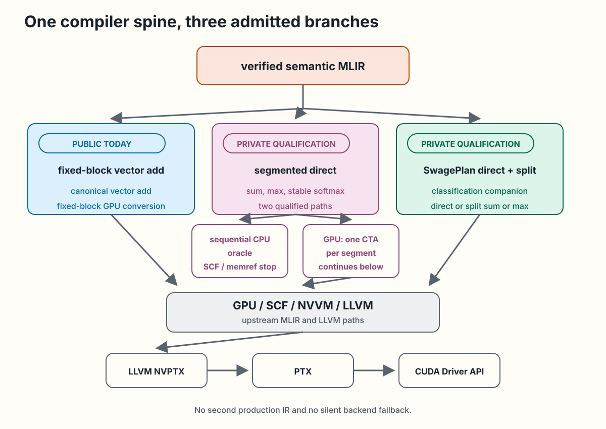
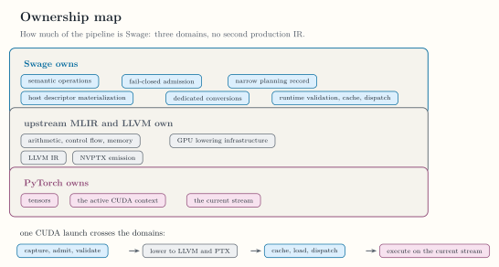

<!-- docs/internals/compiler-pipeline.md -->

# Compiler Pipeline

Swage has one canonical compiler spine. Python source or native test IR
becomes verified semantic MLIR, then an admitted lowering branch uses upstream
MLIR and LLVM infrastructure. There is no second production IR between Python
and MLIR.

Verified semantic MLIR enters one of three admitted branches. The public
fixed-block branch uses the fixed-block conversion for canonical vector
add. Private direct segmented branches lower to the sequential CPU oracle
or the one-CTA GPU path.
The private SwagePlan branch adds the narrow classification companion for
direct or split capture-free reduction lowering. GPU branches rejoin upstream GPU, SCF,
NVVM, and LLVM lowering. One short list of LLVM passes then runs on the
translated module before LLVM NVPTX emits PTX for the CUDA Driver API.
No branch introduces a second production IR or a silent backend fallback.

The two public segmented calls run fixed modules through the private
branches: `swage.segment_softmax` through the one-CTA GPU path, and
`swage.segment_reduce` through the SwagePlan branch. The modules are native
text that the runner holds. No public syntax produces a segment module.

<div class="doc-figure" tabindex="0" markdown="1">



</div>

*The implemented compiler spine and its public and private branches. [Open the full-size figure](../assets/diagrams/compiler-pipeline.svg).*

## Frontend boundary

`@swage.jit` captures source without executing the body. The frontend parses
a restricted Python AST and constructs a live `mlir_swage.ir.Module` directly
through MLIR Python bindings. The module preserves source locations and must
verify before it crosses the frontend boundary.

The exact accepted source forms live in [Kernel Language](../reference/kernel-language.md).
The compile-only and execution call contracts live in
[swage](../reference/swage.md).

## Semantic MLIR boundary

The `swage` dialect represents logical fixed-block and segment semantics.
Runtime segment identity is carried by SSA values, not types. Region-based
maps and reductions remain symbolic until an admitted lowering handles them.
Ordinary arithmetic, loops, buffers, and backend operations use upstream
dialects.

[Swage Dialect](../internals/swage-dialect.md) owns the current operation and
type surface. [SwagePlan Dialect](../internals/swage-plan-dialect.md) owns the
small private planning surface.

## Public fixed-block branch

The fixed-block conversion admits only the canonical vector-add form. It maps
each vector lane to one GPU x-thread, lowers through upstream GPU, SCF, NVVM,
and LLVM infrastructure, and emits PTX in process with LLVM NVPTX. The public
runtime launches that result through the CUDA Driver API.

No `nvgpu` dialect conversion is part of this implemented branch. Runtime
specialization, cache, module loading, stream, and retention behavior live in
[Runtime and Environment](../reference/runtime-environment.md).

## Private direct segmented branches

Canonical segmented sum, max, and stable ragged-softmax modules enter through
native qualification, not the public Python frontend. A segment function
declares its arguments with `swage.role` attributes, a module may hold any
number of segment functions, and each conversion lowers every one of them
or the one its `function` option names. A conversion first fuses every
`swage.map` of an admitted function into its consumer, so each reduction
and each terminal store carries one element region. One conversion creates
a sequential CPU correctness oracle. Another creates one CTA per segment and
continues through upstream GPU, NVVM, LLVM, and NVPTX stages. The public
`swage.segment_softmax` launches the softmax module on that GPU path.

Exact admitted module shapes and internal ABIs live in
[Segmented Reductions](segmented-reductions.md) and
[Ragged Softmax](ragged-softmax.md).

## Plan stage

Every segmented kernel and the sequential CPU oracle are lowered in two
steps. The planner replaces an admitted segment function by a plan
function: the parameter list of the kernel, its launch width, and one task
operation that takes every buffer and every bound as an operand and holds
the reductions and stores of one bound segment. A dialect conversion then
turns each plan function into a `gpu.module`, with one pattern per
operation. The oracle is planned in place with `policy<sequential>` and
converted to loops over its memrefs by `--swage-plan-to-scf`, which lowers
reductions and stores with the patterns the kernel conversion uses.
`--swage-to-plan` and the two conversions run the steps from text, and the
code generation C API runs the planner and the kernel conversion as two
passes.
[ADR-0020](../adr/ADR-0020-planned-per-function-lowering.md) records the
order in which the schedules moved to this shape.

```text
swage (roles on arguments)
  --swage-to-plan='schedule=...'   admit, fuse maps, build one plan function
swage_plan (kernel signature + task operation with explicit bounds)
  --swage-plan-to-gpu              dialect conversion, no options
gpu + scf + arith + llvm
  --swage-plan-to-scf              the same for policy<sequential>
scf + arith + memref
```

## Private SwagePlan branch

For a capture-free, single-stage sum, max, or min over f32 or f64 values,
planning admission accepts the program without changing the module. A
program may also divide its sum by the extent of its segment, which makes it
a mean. Validated host metadata is then classified and materialized into
direct IDs or split records. Private lowering factories produce the direct,
partial, and merge kernels used by the qualification runtime. Element
programs and single-consumer map chains are reused by direct and partial
kernels; merge kernels combine only the partial results, and the merge of a
mean divides the combined sum once. The public `swage.segment_reduce`
launches the identity sum, maximum, minimum, and mean through this branch
with the default limits. A program over rank-two values takes the direct
schedule alone: the planner writes a task operation of `policy<column>`,
and the conversion emits the column kernel, in which a thread reduces a
column and no thread combines with another. The softmax over rank-two
values takes the same schedule: a thread runs the two reductions and the
map store of its column one after the other.

This branch implements narrow rule-based classification and split task
decomposition. One private experimental lowering consumes those materialized
descriptors through persistent device claim counters and split completion
publication; its predeclared performance gate failed. The branch does not
implement general cost inference, general schedule selection, packing, or a
public reusable queue.

## LLVM pass pipeline

Every GPU branch translates its lowered module to LLVM IR and runs the same
list of LLVM passes on it before the NVPTX backend emits PTX. The list
applies to the public fixed vector add and to every private segmented
kernel:

| Pass | What it does to a kernel |
|---|---|
| `early-cse` | Keeps one value for each repeated subexpression |
| `instcombine` | Folds casts, comparisons, and index arithmetic |
| `simplifycfg` | Merges blocks and turns small branches into selects |
| `loop-rotate` | Leaves one conditional branch in each loop iteration |
| `licm` | Hoists loop-invariant arithmetic out of loops |
| `instcombine` | Folds what rotation and hoisting exposed |

The list is curated instead of a default `O2` or `O3` pipeline, because the
passes must leave three things exactly as the lowering produced them:

- **Synchronization.** Each barrier, warp shuffle, memory fence, and atomic
  of the lowering reaches the PTX once. A default pipeline for this target
  narrows the thread-index ranges from the launch width and then deletes
  shuffle paths for small block sizes, so no default pipeline runs. Loop
  unrolling does not run either: the persistent queue loops hold
  synchronization that must not be repeated.
- **Floating-point results.** No pass adds a fast-math flag, reassociates,
  or contracts a multiply and an add. Each floating-point operation stays
  the round-to-nearest operation of the semantic program, in the same order, so
  results are bit-identical to those of the kernels without the passes.
- **The launch contract.** Kernel names, parameters, and the `.reqntid`
  launch width are unchanged. No module-level pass runs.

The passes do not remove the unused shuffle path of a block reduction or
its second barrier. Removing either changes the synchronization structure
that this stage preserves.

`python/tests/mlir/test_kernel_optimization.py` pins the synchronization of
every kernel family and the rotated loops,
`python/tests/mlir/test_segmented_numerics.py` pins the arithmetic, and
`python/tests/mlir/test_segmented_bounds.py` pins the device-side bounds.

## Target description

One record holds what the compiler assumes about the device:
`mlir::swage::TargetDescription` in
`include/swage/Target/TargetDescription.h`. It names the triple and the
admitted processors, the subgroup width (one warp of 32 threads), the widest
block, the block widths of the CTA, split, and persistent kernels, the
persistent claim batches, and the planning defaults. Emitting a device fence
and pinning the launch width of a kernel are two functions of the record.

The segmented and fixed-block lowerings, the code generation C API, and the
private runner all read this record, so a block width or a planning default
is written once. The runner reads it on first use through
`swageGetTargetDescription` in `include/swage-c/Target.h`.

There is one instance, `nvidiaTarget()`. The record does not make Swage
portable: the upstream all-reduce lowering and NVVM conversion hard-code the
same subgroup width, and no second target exists.

## Ownership boundary

Swage currently owns semantic operations, fail-closed admission, the narrow
planning record, host descriptor materialization, the dedicated conversions
required by qualified paths, and the launch runtime's validation, cache, and
dispatch. Upstream MLIR and LLVM own ordinary
arithmetic, control flow, memory operations, GPU lowering infrastructure,
LLVM IR, and NVPTX emission. PyTorch owns tensors, the active CUDA context,
and the current stream.

<div class="doc-figure" tabindex="0" markdown="1">



</div>

*What Swage owns against upstream MLIR and LLVM, and PyTorch. [Open the full-size figure](../assets/figures/ownership-map.svg).*

Continue with [Swage Dialect](swage-dialect.md) for the semantic
surface, [Compiler Tools and Passes](compiler-tools.md) for the
command-line surface, or [Verification](verification.md) to audit the
executable gates for each branch.
