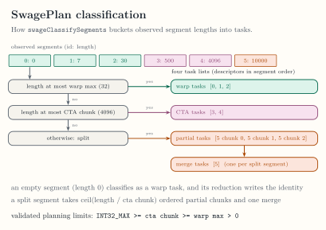

<!-- docs/internals/planning.md -->

# Task Planning

Planning turns an admitted capture-free sum, max, or min and its runtime
offsets
into classified tasks without executing them. This page records the
exact internal contracts; none of them is a public API.

*Qualified through compile-only compiler and classifier tests; see
[Verification](verification.md) and
[ADR-0019](../adr/ADR-0019-composable-private-reductions.md).*

Planning admission accepts a capture-free, single-stage sum, max, or min
over f32 or f64 values, with optional single-consumer map chains and a
scalar output per segment. Element regions use the existing admitted
arithmetic and `math.exp2` operations, and every value of a region has the
element type of the function. `math.exp2` is admitted in an f32 program
only, because the device has no f64 `exp2`.
Admission is read-only analysis of one segment function. Captures, multiple
reductions, and map-store outputs remain outside static planning. Persistent
execution retains its separate restriction to the f32 identity sum.

A program may divide its reduction by the extent of its segment, which is
how a mean is written. Admission accepts exactly that scalar epilogue:
`swage.extent` of the segment, `arith.index_cast` to the count type,
`arith.sitofp` to the element type, and `arith.divf` of the reduction result
by that value, whose quotient the function stores. The epilogue is not an
element program, so it adds no element work and the schedule selection
treats a mean as it treats its sum. The classification of a batch does not
depend on it either.

A function over rank-two values is not planned in this sense. It has one
kernel, the direct schedule with the column policy, takes no task buffer,
and nothing classifies its segments. Planning admission refuses it for every
schedule that reads a task buffer, and
[Segmented Reductions](segmented-reductions.md#rank-two-values) describes
its kernel.

Two callers run the same admission. `--swage-to-plan` with
`schedule=task-ids` admits a function and then replaces it by the plan
function of the task-id kernel, described on
[SwagePlan Dialect](swage-plan-dialect.md). The private runner admits a
program through `swageMaterializeSegmentedPlan`, which also checks the two
planning limits and builds no IR. The limits steer host classification and
no kernel reads them, so they are arguments of the classifier and do not
appear in plan IR.

The default legal policy order is warp then CTA. The default warp limit is 32
elements, and the default CTA chunk limit is 4096 elements. The host
classifier validates signed i32 counts and monotonic offsets before producing
stable descriptors. The planning gate does not execute a policy. Segments
above the CTA chunk limit classify as split work;
[Split Execution](split-execution.md) records the decomposition and the
validated planning-limit invariant.

Admission and classification are separate steps. Admission depends on the
program and the two limits only, so the private runner admits once per
program and pair of limits, on a layout without segments. Each
preparation then classifies its offsets through `swageClassifySegments`, which
takes the offsets buffer and the limits, uses no module and no MLIR context,
and writes the warp ids, the CTA ids, the partial ranges, the merge records,
and the merge of every partial task into one buffer in a single allocation.
The descriptor classifier stays the reference: unit tests require the records
to equal the regrouped descriptors and every rejection to carry the same
message.

The classifier checks what the Python validation of a host offsets array
checks, so a preparation walks valid offsets once, in the classifier, at the
point where the offsets are validated. When the classifier refuses, the
Python validation runs and raises its own message, so the exception types,
the messages, and their order are unchanged.

The private `_prepare_planned_reduction` helper can select the existing
pure CTA implementation after validating the native plan. The public
`swage.segment_reduce` applies the same rule with the defaults below through
`_launch_planned_reduction`, which enqueues the selected schedule in one
step and prepares no other policy. With default 4096-element
chunks, it avoids splitting when every segment has 4097–8192 elements and the
batch has at least as many segments as the device has SMs. The selected
`mixed` callable aliases `cta`, and preparation skips split kernel compilation
and scratch allocation. Selection does not execute or time the program.

The element program must also fit a 32-unit relative work budget. The
estimate is native: `swageEstimateElementWork` walks the typed operations of
the admitted MLIR, where add, subtract, multiply, minimum, and maximum cost
one unit each, `math.exp2` costs eight, and division costs sixteen.
Constants and yields are free. Work is counted across all map
and reduction regions, so splitting a long expression into maps does not
bypass the limit. The helper compares the estimate with the budget, which
stays a host parameter of the selection rule. These empirically chosen weights are scheduling hints, not
GPU instruction latency estimates. Larger programs retain split execution.

This is a conservative rule measured on A6000 and RTX 5090, not a general cost
model. Sparse batches, mixed direct/split batches, longer segments, and custom
chunk sizes retain the fixed schedule. `select_schedule=False` explicitly
disables selection. The legacy `_prepare_planned_sum` wrapper always uses the
fixed policy, preserving existing qualification and frozen benchmark inputs.
Native classification, descriptors, and public APIs are unchanged.

*SwagePlan classification buckets, including the split bucket, and the validated planning-limit invariant. [Open the full-size figure](../assets/figures/plan-classification.svg).*

Continue with [Task Execution](task-execution.md) for the qualified
warp, CTA, and fused paths. Plan IR itself is on the previous page,
[SwagePlan Dialect](swage-plan-dialect.md).
