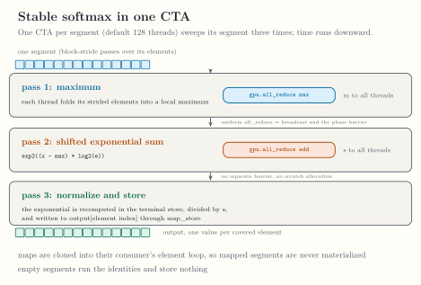

<!-- docs/internals/ragged-softmax.md -->

# Ragged Softmax

Stable ragged softmax executes all phases in one CTA per segment
with fused maps. This page records the exact internal contracts;
none of them is a public API.

*Qualified under the M5 gate on NVIDIA RTX A6000 (`sm_86`);
see [`ROADMAP.md`](https://github.com/abhiksark/swage/blob/main/ROADMAP.md) and [ADR-0013](../adr/ADR-0013-m5-fusion-and-map-store-abi.md).*

The softmax path retains the five-argument ABI. It admits ordered f32 reduction captures,
single-consumer map chains, and exactly one scalar store or map-store
terminal. The stable softmax module performs maximum, shifted exponential
sum, and normalize/store phases. Maps are fused into their consumer.

The CPU path executes the phases sequentially. The GPU path executes all
phases in one CTA per segment. Exact-target GPU compilation requires `sm_80`
or newer because the path uses native `exp2`. The runner validates host-visible
offset metadata, capacity, and output disjointness. Empty segments perform no
map-store writes.

*The one-CTA softmax schedule, with all-reduce as broadcast and phase barrier. [Open the full-size figure](../assets/figures/m5-softmax-phases.svg).*

Continue with [Task Planning](planning.md) for how segments become
schedulable tasks.
