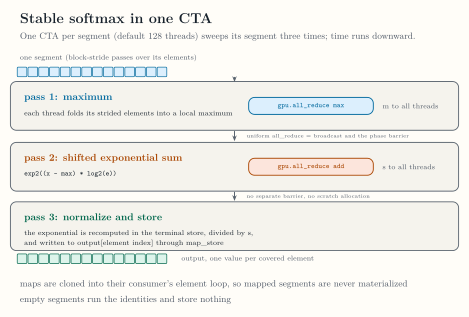

<!-- docs/internals/ragged-softmax.md -->

# Ragged Softmax

Stable ragged softmax executes all phases in one CTA per segment
with fused maps. This page records the exact internal contracts;
none of them is a public API. The public `swage.segment_softmax` launches
this path with the default 128-thread block and requires offsets that cover
every value. For rank-two values it launches the column kernel that
[Rank-two values](#rank-two-values) describes.

*Qualified on NVIDIA RTX A6000 (`sm_86`); see
[Verification](verification.md) and
[ADR-0013](../adr/ADR-0013-fusion-and-map-store-abi.md).*

The softmax path retains the five-argument ABI defined in
[Segmented Reductions](segmented-reductions.md). It admits ordered f32
reduction captures,
single-consumer map chains, and exactly one scalar store or map-store
terminal. The stable softmax module performs maximum, shifted exponential
sum, and normalize/store phases. Maps are fused into their consumer.

The CPU path executes the phases sequentially. The GPU path executes all
phases in one CTA per segment. Exact-target GPU compilation requires `sm_80`
or newer because every Swage compile request must name a processor from the
admitted list in [Runtime and Environment](../reference/runtime-environment.md).
The floor is not specific to this path: native `exp2` on f32 is legal for
every processor in the pinned NVPTX backend. The backend has no f64 `exp2`,
so planning admission refuses the program over f64 values and
`swage.segment_softmax` refuses float64 values. The runner validates host-visible
offset metadata, capacity, and output disjointness. Empty segments perform no
map-store writes.

<div class="doc-figure" tabindex="0" markdown="1">



</div>

*The one-CTA softmax schedule, with all-reduce as broadcast and phase barrier. [Open the full-size figure](../assets/figures/ragged-softmax-phases.svg).*

## Rank-two values

Over rank-two values the softmax normalizes one column of one segment per
program instance, as `torch.softmax(values[a:b], dim=0)` does for the rows
`a` to `b` of a segment. The program is the rank-one program with the
second segment id of
[Segmented Reductions](segmented-reductions.md#rank-two-values): it
declares the `feature_count` role, `swage.make_segment` binds
`swage.segment_id 1` as the column, and `swage.map_store` writes a
rank-two output. Its kernel function is `ragged_softmax_r2`, and it takes
the six parameters of the column kernel:

```text
values*, offsets*, output*, value_count:i32, segment_count:i32,
feature_count:i32
```

`value_count` is the number of rows. `values` and `output` hold rows of
`feature_count` elements in row order, and the store writes the element
it read from: the row and the column of a value are the row and the column
of its result.

The kernel is the column tile of the reductions, with three stages in
place of one:

- **One block per segment.** The rows of the segment are loaded from the
  offsets and clamped to `value_count`. The public call passes the number
  of rows of the values, which is the number of rows of the output. The
  private launch admits a shorter output and passes the smaller number.
- **One column per thread at a time.** Thread `t` of a block of 128 takes
  the columns `t`, `t + 128`, and so on. The loop over those columns is
  bounded by `feature_count`.
- **Three walks over a column.** A thread computes the maximum of its
  column, then the sum of the shifted exponentials, then stores every
  normalized element, each time in row order.
- **One scalar per stage.** A thread holds the maximum and the sum of the
  column it works on, never a value per column or per row.
- **No combination across threads.** The kernel holds no shuffle, no
  barrier, and no shared memory. The two all-reduce operations of the
  rank-one kernel, which combine the threads of a block and separate its
  phases, do not exist in it.
- **No split and no warp schedule.** A segment occupies one block for its
  whole length.

The limits are those of the column tile. With few columns few threads of a
block work: a segment of 10,000 rows and three columns is three walks of
10,000 rows, one row after the other, in each of three threads. A batch
with a heavy tail of long segments keeps few blocks busy for a long time.
The bits of a column do not depend on the batch, on the block width, or on
the GPU model.

`swage.segment_softmax` runs this kernel for `[N, D]` values with more
than one column. `[N, 1]` values run the rank-one kernel through a view,
and `[N, 0]` values launch nothing. The CPU oracle lowers the same program
to a loop over the segments, a loop over the columns, and the three stages
over the rows. The kernel and the oracle add in the same order and differ
in the exponential, `ex2.approx.f32` on the device and `exp2f` on the
host, so the tests compare them within a tolerance and not bit for bit.

The driver-level tests of `python/tests/mlir/test_segmented_bounds.py`
launch the kernel below the Python validation: with row ranges that
validation rejects, with more blocks than segments, with feature counts of
zero and below, and with an output of fewer rows than the values. Values
sit between NaN guards and the output between canaries.

## Accuracy

The kernel computes each exponential in f32 as `exp2((v - max) * log2e)`,
with `log2e` the f32 constant `1.44269502`, and lowers `exp2` to the device
instruction `ex2.approx.f32`. The subtraction, the multiplication, the sum,
and the division are IEEE-754 round-to-nearest operations with no
contraction, which a compile-only test checks in the PTX. `ex2.approx.f32`
is the only approximate operation.

The error of an output grows with the distance of its logit below the
segment maximum, `d = max - v`, because rounding the exponent by a relative
amount `t` changes `exp(-d)` by `d * t`. To first order the relative error
of an output is at most

```text
(1.12 * (d + dbar) + 2 * E + 1.5 + k / 2) * eps32
```

where:

- `eps32` is `2**-23`.
- `1.12 * d` covers the rounding of the subtraction and of the
  multiplication, half an `eps32` each, and the f32 constant, which is
  `0.11 * eps32` below `log2(e)`.
- `dbar` is the mean of `d` over the segment weighted by the softmax
  probabilities. It is the error that the normalizer inherits from its
  terms. It is about 1 when the logits are spread evenly, and it exceeds
  neither the spread nor the natural logarithm of the segment length.
- `E` is the relative error of `ex2.approx.f32` in units of `eps32`, counted
  once for the output and once for the normalizer. The bound uses 1.5.
- `k` is the number of rounding additions of the normalizer. For rank-one
  values it is `ceil(n / 128) + 6`, the additions of the 128-lane sum over
  a segment of `n` elements (see
  [Segmented Reductions](segmented-reductions.md#sum-rounding)). For
  rank-two values it is `n - 1`: a thread adds the `n` rows of its column
  one after the other.
- `1.5` covers the division and the higher-order terms.

Both `d` and `dbar` are at most the spread of the segment, the difference
between its largest and smallest logit. As a function of spread alone the
bound is therefore

```text
(2.24 * spread + 4.5 + k / 2) * eps32
```

for any distribution of the logits, which is `2.4e-05` at spread 80 for a
4096-element segment of rank-one values. For rank-two values the term
`k / 2` is `(n - 1) / 2` and grows with the number of rows, so the bound
of a long segment is weaker than the rank-one bound: at 4096 rows it is
`2.7e-04` at the same spread. The other terms are the same, and a column
is bounded on its own.

The tests of rank-two values assert the first form with `k = n - 1` for
every output of every column against `torch.softmax` in float64 along the
rows of a segment, at 3, 64, 129, 200, and 1024 columns and for a segment
of 100,003 rows.

For rank-one values, a test asserts the first form for every output
against `torch.softmax` in float64, at spreads 8, 20, 50, and 80. Its segments hold logits on a grid
of eighths, uniformly drawn logits in segments of up to 4096 elements, and
one maximum above a single far level. The largest errors it measures on the
RTX A6000 (`sm_86`) are:

| Spread | Largest relative error | In `eps32` | Fraction of the bound |
|---|---|---|---|
| 8 | `5.5e-07` | 4.6 | 0.25 |
| 20 | `1.0e-06` | 8.4 | 0.32 |
| 50 | `3.4e-06` | 28.2 | 0.45 |
| 80 | `3.7e-06` | 31.0 | 0.44 |

The same file measures `ex2.approx.f32` alone, through one-element sums of
`exp2`, over `2**20` evenly spaced arguments from -126 to 126. On the RTX
A6000 every result is within 2 ulp of the correctly rounded f32 and within
`1.22 * eps32` of the exact value, and every integer argument is exact. The
test asserts 2 ulp and `1.5 * eps32`. No other architecture has been
measured.

The bound applies to outputs that are normal f32 numbers. A logit more than
about 87 below its segment maximum has an output below the smallest normal
f32, which is subnormal or zero and carries no relative accuracy. The
comparison against float32 PyTorch in `test_segmented_runtime.py` keeps its
relative tolerance of `2e-06`, which is sized for spreads of at most 8.

Continue with the [SwagePlan Dialect](swage-plan-dialect.md) for the
planning IR, and then [Task Planning](planning.md) for how segments become
schedulable tasks.
