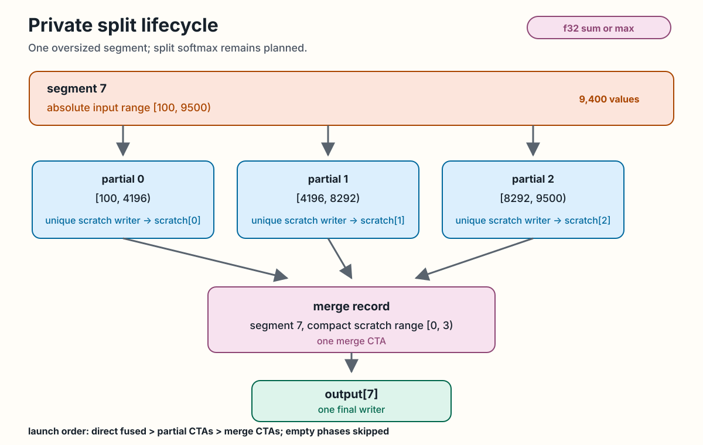

<!-- docs/internals/split-execution.md -->

# Split Execution

Segments longer than the CTA chunk limit split into ordered partial
tasks and one merge. This page records the exact internal
contracts; none of them is a public API.

*Qualified on NVIDIA RTX A6000 (`sm_86`); see
[Verification](verification.md) and
[ADR-0017](../adr/ADR-0017-private-split-cta-reductions.md) and
[ADR-0019](../adr/ADR-0019-composable-private-reductions.md).*

Segments of at most 32 elements receive one direct warp descriptor. Segments
from 33 through 4096 elements receive one direct CTA descriptor. A longer
segment receives ordered stage-zero CTA chunks of at most 4096 input elements
and one stage-one merge descriptor. These are current defaults and must satisfy
the planning-limit invariant.

The figure uses one oversized identity-sum segment over absolute input range
`[100, 9500)`. Its three ordered partial CTAs own `[100, 4196)`,
`[4196, 8292)`, and `[8292, 9500)`. Each partial has one unique scratch
writer. The merge record names segment 7 and compact scratch range `[0, 3)`,
then one writer stores `output[7]`. Mixed execution submits direct fused work,
partial CTAs, and merge CTAs in that order on the current stream, skipping any
empty phase. This lifecycle supports private capture-free, single-stage f32
sum and max, including fused map chains. Partial tasks evaluate the element
program on input values; merges combine scratch using the reduction kind
without reapplying that program. It does not support split softmax.

<div class="doc-figure" tabindex="0" markdown="1">



</div>

*Private ownership and launch order for one split identity sum. [Open the full-size figure](../assets/diagrams/split-lifecycle.svg).*

Partial ABI:

```text
values*, partial_ranges*, scratch*, value_count:i32, partial_count:i32
```

Merge ABI:

```text
scratch*, output*, merge_records*, partial_count:i32, merge_count:i32,
segment_count:i32
```

Both kernels use 512 threads, sized so one 4096-element chunk fully
occupies a CTA at eight elements per thread. Partial ranges are absolute
half-open input ranges, and each partial writes one unique scratch slot.
Merge records carry a segment ID and a compact half-open scratch range;
thread zero writes the final segment result once. The merge kernel compares
the segment ID with `segment_count` and stores nothing for an ID outside it.

If no split exists, the direct one-launch path remains unchanged. Exact
all-one and tolerant nontrivial f32 cases match PyTorch and the
sequential CPU oracle on NVIDIA RTX A6000 `sm_86`.

Split execution does not implement packed warps, split softmax, captured
stages, device queues, persistent scheduling, public segment syntax,
or public segmented launch.

Continue with [Verification](verification.md) for the executable
proof behind these claims, or [Benchmarks](benchmarks.md) for the
recorded campaign.
