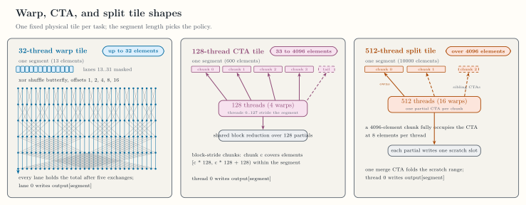
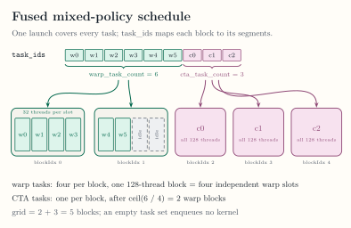

<!-- docs/internals/task-execution.md -->

# Task Execution

Classified warp and CTA tasks execute through fixed tiles, either
as pure launches or one fused mixed launch. This page records the
exact internal contracts; none of them is a public API.

*Qualified on NVIDIA RTX A6000 (`sm_86`); see
[Verification](verification.md),
[ADR-0015](../adr/ADR-0015-minimal-mixed-policy-execution.md), and
[ADR-0016](../adr/ADR-0016-fused-mixed-policy-schedule.md).*

Pure warp and pure CTA qualification use this task-ID ABI:

```text
values*, offsets*, output*, task_ids*, value_count:i32, task_count:i32
```

<div class="doc-figure" tabindex="0" markdown="1">



</div>

*Fixed physical tile shapes for warp, CTA, and split tasks under the default planning limits. [Open the full-size figure](../assets/figures/warp-vs-cta-tiles.svg).*

The warp kernel uses 32 threads. The CTA kernel uses 128 threads. Fused mixed
execution uses one 128-thread kernel and this ABI:

```text
values*, offsets*, output*, task_ids*, value_count:i32,
warp_task_count:i32, cta_task_count:i32
```

Each initial block contains four independent one-segment warp slots. CTA
tasks follow at one segment per block. An empty task set enqueues no kernel.
Static execution admits capture-free, single-stage f32 sum/max programs,
including fused map chains. Each schedule evaluates the same element program
only on valid input elements. See
[ADR-0019](../adr/ADR-0019-composable-private-reductions.md).

<div class="doc-figure" tabindex="0" markdown="1">



</div>

*The one-launch fused schedule and its task-ID indirection. [Open the full-size figure](../assets/figures/fused-mixed-schedule.svg).*

The private preparation helpers memoize compiled kernels per program, code
generation options, and target, and loaded modules per CUDA context, so a
preparation compiles and loads only the kernels that the process has not
already compiled and loaded. A prepared launch raises if the offsets tensor
was modified in place after preparation, which it detects through the tensor
version counter; the kernels additionally clamp every loaded range that
indexes the values buffer to the value count. CUDA graph capture needs an
earlier launch that observed task storage ready, so the protocol is launch,
synchronize, launch again, then capture.

For identity sum, the frozen NVIDIA RTX A6000 `sm_86` benchmark reports medians of
`0.067584 ms` for pure warp, `0.070656 ms` for pure CTA, and `0.063488 ms`
for fused mixed execution. The fused schedule it measures is the one drawn
above. The mixed-to-best-pure ratio is `0.939394`, which passes the
predeclared maximum of `1.05`; the first two-launch schedule measured
`1.238806` on the same frozen input and failed that gate before the fused
schedule was predeclared in
[ADR-0016](../adr/ADR-0016-fused-mixed-policy-schedule.md). The committed
raw record is
[`benchmarks/results/mixed-sum-a6000-sm86.json`](https://github.com/abhiksark/swage/blob/main/benchmarks/results/mixed-sum-a6000-sm86.json).

Continue with [Split Execution](split-execution.md) for oversized
segments, or [Benchmarks](benchmarks.md) for the recorded campaign.
