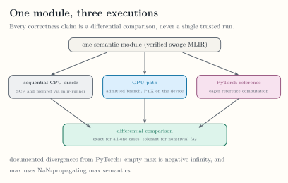

<!-- docs/internals/verification.md -->

# Verification

Status claims are grounded in executable tests and committed artifacts. This
matrix identifies the smallest evidence source for each current boundary and
does not turn private qualification into public API. The two public
segmented calls have rows of their own; the private rows below them cover
the paths the calls run through.

*The comparison topology behind every correctness claim. [Open the full-size figure](../assets/figures/oracle-topology.svg).*

| Boundary | Status | Primary evidence | Applicable command |
|---|---|---|---|
| Pure `swage` wheel contents and native-package exclusion | Public today | `tests/python/test_packaging.py` | `python -m pytest tests/python/test_packaging.py -q` |
| Environment report | Public today | `tests/python/test_env.py` | `python -m pytest tests/python/test_env.py -q` |
| Build identity of the bindings, the check that pairs `swage` with them, and the content identity of the native libraries in the cache key | Public today | `tests/python/test_native_identity.py`, `python/tests/mlir/test_native_identity.py` | `python -m pytest tests/python/test_native_identity.py -q`; `ninja -C build check-swage-python` |
| Native wheel assembly: contents, metadata, record, and refusal of a package that would not relocate | Local build only; no native wheel is published | `tests/python/test_assemble_native_wheel.py` | `python -m pytest tests/python/test_assemble_native_wheel.py -q`. An install of a built wheel is checked by hand and by the `native-wheel` job of `ci-cpp`, which has never run |
| Restricted AST to verified native module, and the kernel-language check without the native package | Public today, compile-only | `tests/python/test_frontend.py`, `python/tests/mlir/test_frontend.py` | `python -m pytest tests/python -q`; `ninja -C build check-swage-python` |
| Emit-only example without a GPU or PyTorch | Public today, compile-only | `python/tests/mlir/test_examples.py` | `ninja -C build check-swage-python` |
| Native `swage` dialect parsing, verification, and declared segment-read effects | Public today, compile-only | `test/Dialect/Swage`, including `effects.mlir` | `ninja -C build check-swage` |
| Fixed vector-add lowering and CUDA launch | Public today | `test/Conversion/SwageToGPU`, `python/tests/mlir/test_runtime.py`, `python/tests/mlir/test_cache_process_reuse.py` | `ninja -C build check-swage`; trusted GPU workflow |
| Launch validation, the PyTorch floor, and the cache bound, read-only mode, and no-compile mode | Public today | `tests/python/test_runtime.py`, `python/tests/mlir/test_runtime.py` | `python -m pytest tests/python/test_runtime.py -q`; trusted GPU workflow |
| Public segmented calls: names and signatures, the checks that need no native build, the PyTorch floor, and the wheel-only error | Public today | `tests/python/test_segments.py` | `python -m pytest tests/python/test_segments.py -q` |
| Public segmented calls: argument and offsets validation on host tensors | Public today | The tests of `python/tests/mlir/test_public_segments.py` that need no GPU | `ninja -C build check-swage-python` |
| Public segmented calls: results against `torch.segment_reduce`, `torch.softmax`, and float64 on the nine benchmark distributions, empty batches and segments, long segments, and special values; the schedule of a public sum; `out`; graph capture, streams, threads, inference mode, and no-compile mode; resource use over repeated calls; and the segmented example | Public today | The CUDA tests of `python/tests/mlir/test_public_segments.py`, `python/tests/mlir/test_examples.py` | Trusted GPU workflow |
| Compile-only PTX emission for every admitted processor, public and private kernels | Public today, compile-only; private qualification | `python/tests/mlir/test_target_compile.py` | `ninja -C build check-swage-python` |
| Loaded-module lifetime, in-process cache bounds, cold-path locking, and the context and overlap guards of prepared launches | Public today; private qualification | `python/tests/mlir/test_module_lifetime.py` | `ninja -C build check-swage-python`; trusted GPU workflow |
| C API contract: code generation entry points, failure reporting, and dialect handles | Compiler-facing, not public API | `unittests/CodegenCAPITest.cpp`, `unittests/DialectsCAPITest.cpp` | `ninja -C build check-swage-unit` |
| The C API lowering pipeline, through the nested NVVM conversion, run from text by `swage-opt` | Compiler-facing, not public API | `test/Conversion/SwageToGPU/nvvm-pipeline.mlir` | `ninja -C build check-swage` |
| Emitted kernel text: the SHA-256 of the lowered MLIR and of the PTX of every kernel in a matrix of programs, schedules, and admitted processors, against a committed record | Compiler-facing, not public API | `python/tests/mlir/test_ptx_digests.py` with `ptx_digests.json` | `ninja -C build check-swage-python` |
| Target description: one record of block widths, claim batches, planning defaults, and processors, read by the lowerings, the C API, and the private runner | Compiler-facing, not public API | `unittests/TargetDescriptionTest.cpp`, `python/tests/mlir/test_bindings.py` | `ninja -C build check-swage-unit`; `ninja -C build check-swage-python` |
| Segment functions: argument roles in any order, the kernel parameter layouts, any number of segment functions in a module, the `function` option, and the symbol checks before a GPU lowering changes a module | Compiler-facing, not public API | `test/Dialect/Swage/roles.mlir`, `invalid-roles.mlir`, the `roles-reordered.mlir`, `two-kernels.mlir`, `no-segment-function.mlir`, `invalid-function-option.mlir`, `invalid-kernel-symbols.mlir`, and `invalid-split-kernel-symbols.mlir` files under `test/Conversion`, `unittests/KernelLayoutTest.cpp`, `unittests/CodegenCAPITest.cpp` | `ninja -C build check-swage`; `ninja -C build check-swage-unit` |
| Map fusion: a `swage.map` with one consumer moves into that consumer, in the pass and in the lowerings, and nothing else changes | Compiler-facing, not public API | `test/Dialect/Swage/fuse-maps.mlir`, `test/Conversion/SwageToCPU/unused-reduction.mlir`, the map and softmax files under `test/Conversion` | `ninja -C build check-swage` |
| Segmented sum and max CPU/GPU parity, device-side range and index bounds, and block-size admission | Private qualification | `test/Conversion/SwageToCPU`, `test/Conversion/SwageToGPU`, including `segment-bounds.mlir`, `segment-id-bounds.mlir`, `invalid-block-size.mlir`, and `invalid-unverified.mlir` (which turns parse-time verification off on purpose to reach the lowering's own checks), `python/tests/mlir/test_segmented_runtime.py`, `python/tests/mlir/test_segmented_bounds.py` | `ninja -C build check-swage`; trusted GPU workflow |
| Stable ragged-softmax parity and edge cases | Private qualification | ragged-softmax lit files and `python/tests/mlir/test_segmented_runtime.py` | `ninja -C build check-swage`; trusted GPU workflow |
| Sum rounding and reproducibility by schedule, sum error bound, sum special values, and softmax accuracy by logit spread | Private qualification | `python/tests/mlir/test_segmented_numerics.py` | `ninja -C build check-swage-python`; trusted GPU workflow |
| Synchronization counts and loop shape of every kernel after the LLVM pass pipeline | Public today, compile-only; private qualification | `python/tests/mlir/test_kernel_optimization.py` | `ninja -C build check-swage-python` |
| Planning admission, limits, and descriptors, the record classifier against the descriptor classifier, and host validation and classification against a Python reference | Private qualification | `test/Conversion/SwageToPlan/invalid.mlir`, `unittests/TaskClassifierTest.cpp`, the plan cases of `unittests/CodegenCAPITest.cpp`, `python/tests/mlir/test_segmented_classification.py` | `ninja -C build check-swage`; `ninja -C build check-swage-unit`; `ninja -C build check-swage-python` |
| Plan stage: the plan dialect and its verifiers, the planner for the direct, task-id, and sequential schedules, the conversions of plan functions to kernels and of sequential plans to loops, and their checks on plan IR written by hand | Compiler-facing, not public API | `test/Dialect/SwagePlan`, `test/Conversion/SwageToPlan`, `test/Conversion/SwagePlanToGPU`, `test/Conversion/SwagePlanToSCF`, the unchanged oracle files under `test/Conversion/SwageToCPU`, the unchanged goldens under `test/Conversion/SwageToGPU`, `python/tests/mlir/test_ptx_digests.py` | `ninja -C build check-swage`; `ninja -C build check-swage-python` |
| Pure and fused mixed capture-free sum/max correctness | Private qualification | `test/Conversion/SwageToGPU/fused-mixed.mlir`, `python/tests/mlir/test_segmented_runtime.py` | `ninja -C build check-swage`; trusted GPU workflow |
| Prepared-launch kernel memoization, stale-offsets guard, and graph-capture protocol | Private qualification | `python/tests/mlir/test_segmented_cache.py`, `python/tests/mlir/test_prepared_capture.py` | `ninja -C build check-swage-python`; trusted GPU workflow |
| Frozen mixed-policy performance gate | Private qualification | `benchmarks/results/mixed-sum-a6000-sm86.json`, `tests/python/test_benchmark_mixed_sum.py` | `python -m pytest tests/python/test_benchmark_mixed_sum.py -q` |
| Composable split sum/max, ordering, failures, and f32 parity | Private qualification | `unittests/TaskClassifierTest.cpp`, `test/Conversion/SwageToGPU/split-partial.mlir`, `split-merge.mlir`, and `invalid-split.mlir`, `python/tests/mlir/test_segmented_runtime.py` | `ninja -C build check-swage`; `ninja -C build check-swage-unit`; trusted GPU workflow |
| Persistent claims, fenced split completion, poisoned scratch, graph replay, randomized plans, and failure paths | Experimental; predeclared performance gate failed | `test/Conversion/SwageToGPU/persistent.mlir` and `invalid-persistent.mlir`, `python/tests/mlir/test_segmented_codegen.py`, `python/tests/mlir/test_segmented_runtime.py`, `python/tests/mlir/test_persistent_runtime.py`, `benchmarks/results/persistent-sum-a6000-sm86.json` | `ninja -C build check-swage`; `ninja -C build check-swage-python`; trusted GPU workflow after merge |
| Recorded RTX 5090 performance snapshot | Recorded evidence | `benchmarks/results/perf-5090-sm120.json` | Not re-executable in CI |
| Recorded fresh-offsets and frozen comparison runs on RTX A6000 at `453c56e`, their generated summary page, and the documentation fragments | Recorded evidence | `benchmarks/results/segmented-sum-a6000-sm86-453c56e/`, `tests/python/test_campaign_tables.py` | `python -m pytest tests/python/test_campaign_tables.py -q`; the measurements are not re-executable in CI |
| Public segment syntax, and public launch of a segment program that the caller writes | Planned | No executable public contract | No passing gate yet |
| Packed warps, queues, and persistent scheduling | Planned | No executable public contract | No passing gate yet |

The sequential CPU oracle transports each f32 result as its exact bit
pattern, so oracle comparisons involve no decimal rounding.

Numerical claims have their own evidence in
`python/tests/mlir/test_segmented_numerics.py`:

- Reproducibility: each sum schedule returns the same f32 bits across
  launches, across a new preparation, in a second process, and at another
  position in the batch.
- Schedule dependence: the warp, CTA, and split trees return different bits
  for the same segment, automatic selection changes the bits of a segment
  when the batch reaches the SM count of the device, and the pinned
  schedules do not.
- Sum accuracy: every schedule stays within `k * eps32 * sum(|x|)` of a
  float64 reference at 100,003 to 1,048,577 elements, as does the CTA
  schedule that automatic selection substitutes on a batch of 8192-element
  segments, and every schedule propagates NaN, infinities, and subnormal
  values.
- Code generation: the PTX of every sum kernel and of the softmax kernel
  uses round-to-nearest f32 operations with no fused multiply-add and no
  flush-to-zero. This check needs no GPU.
- Softmax accuracy: every output stays within a relative bound that grows
  linearly with logit spread, at spreads 8, 20, 50, and 80, and
  `ex2.approx.f32` is measured on its own.

[Segmented Reductions](segmented-reductions.md#sum-rounding) states the sum
trees, the bound, and how to pin a schedule.
[Ragged Softmax](ragged-softmax.md#accuracy) states the softmax bound and
the measured errors. All device measurements are from the RTX A6000
(`sm_86`); no other GPU has run them.

The public segmented calls have these checks in
`python/tests/mlir/test_public_segments.py`, on the RTX A6000 (`sm_86`):

- Differential results: sums stay within `k * eps32 * sum(|x|)` of a
  float64 reference and maxima equal `torch.segment_reduce` exactly, on
  seeded batches with the length shape of each of the nine benchmark
  distributions, and on single segments of 100,003 and 1,048,577 elements.
  Softmax outputs stay within the relative bound of
  [Ragged Softmax](ragged-softmax.md#accuracy) against float64
  `torch.softmax`.
- Schedule: a public sum equals the private `mixed` launch with default
  limits and automatic selection bit for bit, and its bits change between
  two batch sizes around the SM count of the device.
- Resource use: 300 calls with offsets not seen before load no module,
  unload none, never synchronize the context, compile nothing, create and
  destroy one CUDA event per reduction, leave device memory where it was,
  and leave nothing for the cycle collector.

These checks were executed on that device from the branch that added the
calls. The trusted GPU workflow has not executed them yet.

Calls that run from an artifact, which
[Running Without the Compiler](../user-guide/deployment.md) describes, have
these checks:

- The writer, in `python/tests/mlir/test_artifact.py` without a device: an
  artifact is written for every admitted processor, each shipped kernel
  equals an independent compile of the same request, and each manifest
  entry states the entry name, the launch width, and the parameters that
  the PTX declares.
- The classifier of the runtime library, in `unittests/RuntimeTest.cpp` and
  `python/tests/mlir/test_segmented_classification.py`: it returns the
  records of the compiler's classifier on seeded layouts that hold every
  classification boundary, and refuses malformed input with the same
  message.
- The loader, in `tests/python/test_artifact.py` without the native build:
  selection, every refusal, and the permission rule.
- Execution, in `python/tests/mlir/test_artifact.py` on the RTX A6000
  (`sm_86`): a process that cannot import `mlir_swage` runs both calls from
  an artifact on batches with the length shape of each of the nine
  benchmark distributions, on a batch that reaches the direct-CTA
  selection, and on one segment of 100,003 elements. The process maps no
  file whose name contains `LLVM`, `MLIR`, `mlir`, `SwagePythonCAPI`,
  `swageDialects`, or `nanobind`. Its results pass the comparisons of the
  public calls above and equal the results of the compiled path bit for
  bit.

These checks were executed from the branch that added artifacts. The
trusted GPU workflow has not executed them yet.

The trusted GPU workflow runs only on `main` through the self-hosted
`swage-gpu` runner. It runs the whole `python/tests/mlir` directory, so every
CUDA-gated test file runs there, including one added later; hosted CI has no
GPU and skips those tests. Documentation in a branch can cite committed
evidence but cannot establish a new GPU result without executing that
workflow or an equivalent recorded qualification. Recorded evidence is a
citation status, not a boundary status: the snapshot row upgrades nothing,
and its numbers are presented on [Benchmarks](benchmarks.md).

One check is opt-in and no workflow runs it.
`python/tests/mlir/test_racecheck.py` runs the direct, task-ID, fused mixed,
split partial and merge, persistent, and softmax kernels under the
racecheck tool of NVIDIA Compute Sanitizer, beside a deliberately racy
kernel that the tool must report. It runs only when `SWAGE_RACECHECK=1` is
set, CUDA is available, and `compute-sanitizer` is found on `PATH` or in the
`compute-sanitizer` directory under `CUDA_HOME`, `CUDA_PATH`, or
`/usr/local/cuda`, where the development machine has version 2023.3 of it;
otherwise it is skipped. No row above relies on it, and this page claims no
result for it.

The hosted `ci-cpp` workflow also defines two jobs that no row above relies
on: a `clang-format` check of the C and C++ sources, and a job that runs the
lit suite and the C++ unit tests under AddressSanitizer and
UndefinedBehaviorSanitizer against the uninstrumented LLVM install. Both
jobs have not yet run on hosted CI, so this page claims no result for them.
The [Support Matrix](../reference/support-matrix.md) lists the versions each
workflow runs with.

Continue with [Benchmarks](benchmarks.md) for the recorded measurements. For
historical planning and release mapping, use
[`ROADMAP.md`](https://github.com/abhiksark/swage/blob/main/ROADMAP.md). For
why the boundaries were chosen, use the [ADR Index](../decisions/index.md).
