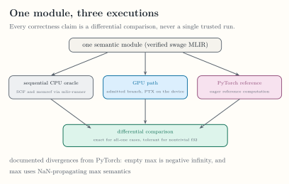

<!-- docs/qualification/evidence.md -->

# Verification Evidence

Status claims are grounded in executable tests and committed artifacts. This
matrix identifies the smallest evidence source for each current boundary and
does not turn private qualification into public API.

*The comparison topology behind every correctness claim. [Open the full-size figure](../assets/figures/oracle-topology.svg).*

| Boundary | Status | Primary evidence | Applicable command |
|---|---|---|---|
| Pure `swage` wheel contents and native-package exclusion | Public today | `tests/python/test_packaging.py` | `python -m pytest tests/python/test_packaging.py -q` |
| Environment report | Public today | `tests/python/test_env.py` | `python -m pytest tests/python/test_env.py -q` |
| Restricted AST to verified native module | Public today, compile-only | `tests/python/test_frontend.py`, `python/tests/mlir/test_frontend.py` | `python -m pytest tests/python -q`; `ninja -C build check-swage-python` |
| Fixed vector-add lowering and CUDA launch | Public today | `test/Conversion/SwageToGPU`, `python/tests/mlir/test_runtime.py` | `ninja -C build check-swage`; trusted GPU workflow |
| Segmented sum and max CPU/GPU parity | Private M4 qualification | `test/Conversion/SwageToCPU`, `test/Conversion/SwageToGPU`, `python/tests/mlir/test_segmented_runtime.py` | `ninja -C build check-swage`; trusted GPU workflow |
| Stable ragged-softmax parity and edge cases | Private M5 qualification | ragged-softmax lit files and `python/tests/mlir/test_segmented_runtime.py` | `ninja -C build check-swage`; trusted GPU workflow |
| Planning admission, limits, and descriptors | Private M6 qualification | `test/Conversion/SwageToPlan`, `unittests/TaskClassifierTest.cpp` | `ninja -C build check-swage`; `ninja -C build check-swage-unit` |
| Pure and fused mixed identity-sum correctness | Private M7 qualification | `python/tests/mlir/test_segmented_runtime.py` | trusted GPU workflow |
| Frozen mixed-policy performance gate | Private M7 qualification | `benchmarks/results/m7-a6000-sm86.json`, `tests/python/test_benchmark_m7_mixed_sum.py` | `python -m pytest tests/python/test_benchmark_m7_mixed_sum.py -q` |
| Split coverage, ordering, failures, and f32 parity | Private M8 qualification | `unittests/TaskClassifierTest.cpp`, `python/tests/mlir/test_segmented_runtime.py` | `ninja -C build check-swage-unit`; trusted GPU workflow |
| Recorded RTX 5090 dispatch and segmented campaign | Recorded evidence | `benchmarks/results/perf-5090-sm120.json`, [Measured Performance](performance.md) | Not re-executable in CI |
| Public segmented syntax and execution | Planned | No executable public contract | No passing gate yet |
| Packed warps, queues, and persistent scheduling | Planned | Roadmap M9 and M10 gates | No passing gate yet |

The trusted GPU workflow runs only on `main` through the self-hosted
`swage-gpu` runner. Documentation in a branch can cite committed evidence but
cannot establish a new GPU result without executing that workflow or an
equivalent recorded qualification.

For milestone acceptance and release mapping, continue with
[`ROADMAP.md`](https://github.com/abhiksark/swage/blob/main/ROADMAP.md). For
why the boundaries were chosen, continue with the [ADR Index](../decisions/index.md).
