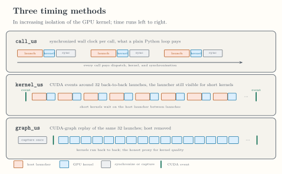
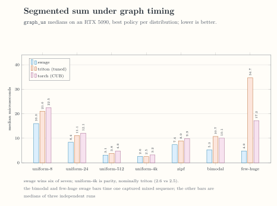

<!-- docs/qualification/performance.md -->

# Measured Performance

!!! warning "Recorded evidence"

    This page reports recorded measurements from one benchmark campaign
    on one machine. It is not a continuously enforced gate and not a
    public performance contract.

## Environment and provenance

All numbers were recorded on 2026-08-27 on an NVIDIA GeForce RTX 5090
(`sm_120`), driver 580.173.02, CUDA 13.0, PyTorch 2.13.0+cu130, and
Triton 3.7.1, on a co-tenant GPU. The committed snapshot
[`benchmarks/results/perf-5090-sm120.json`](https://github.com/abhiksark/swage/blob/main/benchmarks/results/perf-5090-sm120.json)
records the aggregated medians, quartiles, and per-number provenance.
Each value is the median of three independent process runs unless its
provenance field states otherwise. The Triton baseline is the tuned
per-segment kernel, the best of the swept and autotuned configurations,
not the naive one.

## Timing methods

Three timing methods separate host dispatch cost from kernel quality:

- `call_us` is the synchronized wall clock per call, what a plain
  Python loop pays;
- `kernel_us` places CUDA events around 32 back-to-back launches, so
  the host launcher stays visible for short kernels;
- `graph_us` replays the same 32 launches from a captured CUDA graph,
  removing the host and isolating kernel quality.

*How each timing method sees dispatch and kernel time. [Open the full-size figure](../assets/figures/timing-methods.svg).*

## Segmented sum under graph timing

Under graph replay, the best Swage policy per distribution beats
`torch.segment_reduce` on all seven distributions and the tuned Triton
baseline on six of seven. The uniform-4k row is parity, nominally
Triton at 2.6 versus 2.5 microseconds. The bimodal and few-huge Swage
bars time one captured mixed sequence, the planner's fused warp launch
plus the 512-thread split kernels; their provenance fields in the
snapshot record the single-sequence caveat.

*Segmented sum graph-replay medians per distribution; lower is better. [Open the full-size figure](../assets/figures/segsum-graph-comparison.svg).*

Continue with [Verification Evidence](evidence.md) for the executable
proof behind each boundary, or [Private M4 to M8](private-m4-m8.md) for
the execution contracts these measurements exercise.
