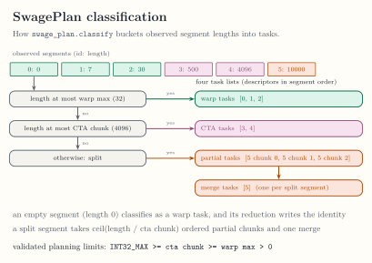
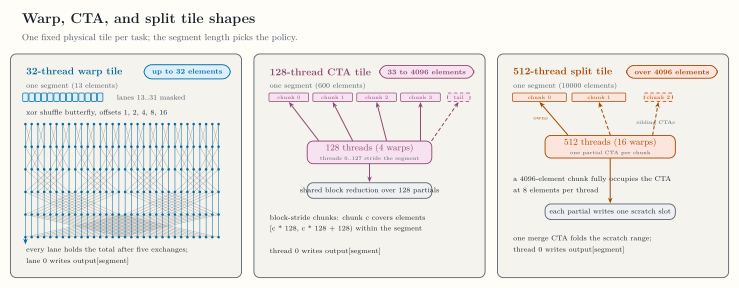
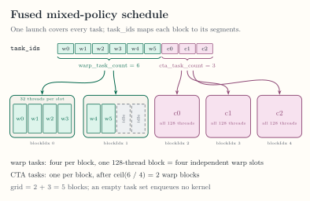
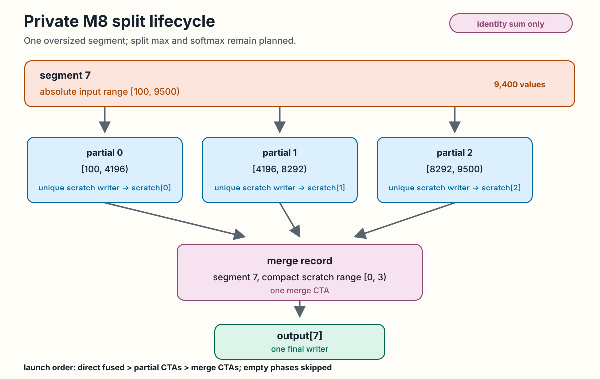

<!-- docs/qualification/private-m4-m8.md -->

# Private M4 to M8 Qualification

This page records exact internal compiler and runtime contracts. None of these
helpers is a public segmented API. They exist to qualify semantics, lowering,
planning, and execution before any public surface is designed.

## M4 segmented sum and max

The admitted semantic module has one axis-zero segment ID, one segment over
rank-one f32 values and rank-one i32 offsets, one capture-free identity
reduction of kind `sum` or `max`, one rank-one f32 output, and explicit i32
value and segment counts.

The internal ABI is:

```text
values*, offsets*, output*, value_count:i32, segment_count:i32
```

The CPU path lowers to sequential SCF and memref operations and executes with
upstream `mlir-runner`. The GPU path uses one CTA per segment and block-stride
loads. Empty sums produce zero; empty maxima produce negative infinity. Max
uses NaN-propagating semantics.

## M5 ragged softmax

M5 retains the five-argument ABI. It admits ordered f32 reduction captures,
single-consumer map chains, and exactly one scalar store or map-store
terminal. The stable softmax module performs maximum, shifted exponential
sum, and normalize/store phases. Maps are fused into their consumer.

The CPU path executes the phases sequentially. The GPU path executes all
phases in one CTA per segment. Exact-target GPU compilation requires `sm_80`
or newer because the path uses native `exp2`. The runner validates host-visible
offset metadata, capacity, and output disjointness. Empty segments perform no
map-store writes.

## M6 planning gate

`--swage-to-plan` admits only a capture-free, map-free, single-stage identity
segmented sum. Admission is read-only. On success it preserves the semantic
function and adds a private companion with `swage_plan.classify`.

The default legal policy order is warp then CTA. The default warp limit is 32
elements, and the default CTA chunk limit is 4096 elements. The host
classifier validates signed i32 counts and monotonic offsets before producing
stable descriptors. M6 does not execute a policy.

<div class="doc-figure" tabindex="0" markdown="1">



</div>

*SwagePlan classification buckets, including the M8 split bucket, and the validated planning-limit invariant. [Open the full-size figure](../assets/figures/plan-classification.svg).*

## M7 direct warp and CTA execution

Pure warp and pure CTA qualification use this task-ID ABI:

```text
values*, offsets*, output*, task_ids*, value_count:i32, task_count:i32
```

<div class="doc-figure" tabindex="0" markdown="1">



</div>

*Fixed physical tile shapes for direct warp and CTA tasks under the default M6 limits. [Open the full-size figure](../assets/figures/warp-vs-cta-tiles.svg).*

The warp kernel uses 32 threads. The CTA kernel uses 128 threads. Fused mixed
execution uses one 128-thread kernel and this ABI:

```text
values*, offsets*, output*, task_ids*, value_count:i32,
warp_task_count:i32, cta_task_count:i32
```

Each initial block contains four independent one-segment warp slots. CTA
tasks follow at one segment per block. An empty task set enqueues no kernel.
The M7 qualification is limited to canonical identity sum.

<div class="doc-figure" tabindex="0" markdown="1">



</div>

*The one-launch fused schedule and its task-ID indirection. [Open the full-size figure](../assets/figures/fused-mixed-schedule.svg).*

The frozen NVIDIA RTX A6000 `sm_86` benchmark reports medians of
`0.067584 ms` for pure warp, `0.070656 ms` for pure CTA, and `0.063488 ms`
for fused mixed execution. The fused schedule it measures is the one drawn
above. The mixed-to-best-pure ratio is `0.939394`, which
passes the predeclared maximum of `1.05`. The committed raw record is
[`benchmarks/results/m7-a6000-sm86.json`](https://github.com/abhiksark/swage/blob/main/benchmarks/results/m7-a6000-sm86.json).

## M8 split-CTA identity sum

Segments of at most 32 elements receive one direct warp descriptor. Segments
from 33 through 4096 elements receive one direct CTA descriptor. A longer
segment receives ordered stage-zero CTA chunks of at most 4096 input elements
and one stage-one merge descriptor. These are current defaults and must satisfy
the planning-limit invariant.

The figure uses one oversized identity-sum segment over absolute input range
`[100, 9500)`. Its three ordered partial CTAs own `[100, 4196)`,
`[4196, 8292)`, and `[8292, 9500)`. Each partial has one unique scratch
writer. The merge record names segment 7 and compact scratch range `[0, 3)`,
then one writer stores `output[7]`. Mixed execution submits direct fused work,
partial CTAs, and merge CTAs in that order on the current stream, skipping any
empty phase. This lifecycle is private identity-sum qualification only; it
does not imply split max or split softmax.

<div class="doc-figure" tabindex="0" markdown="1">



</div>

*Private M8 ownership and launch order for one split identity sum. [Open the full-size figure](../assets/diagrams/m8-split-lifecycle.svg).*

Partial ABI:

```text
values*, partial_ranges*, scratch*, value_count:i32, partial_count:i32
```

Merge ABI:

```text
scratch*, output*, merge_records*, partial_count:i32, merge_count:i32
```

Both kernels use 512 threads, sized so one 4096-element chunk fully
occupies a CTA at eight elements per thread. Partial ranges are absolute
half-open input
ranges, and each partial writes one unique scratch slot. Merge records carry a
segment ID and a compact half-open scratch range; thread zero writes the final
segment result once.

Mixed execution submits direct fused work, all partial CTAs, then all merge
CTAs on one current stream. Empty phases are skipped. If no split exists, the
M7 one-launch path remains unchanged. Exact all-one and tolerant nontrivial
f32 cases match PyTorch and the sequential CPU oracle on NVIDIA RTX A6000
`sm_86`.

M8 does not implement packed warps, split max, split softmax, device queues,
persistent scheduling, public segment syntax, or public segmented launch.

Continue with [Verification Evidence](evidence.md) for the executable proof
behind each boundary, [Measured Performance](performance.md) for the recorded
RTX 5090 campaign, or
[SwagePlan Dialect](../reference/swage-plan-dialect.md)
for the private planning IR surface.
