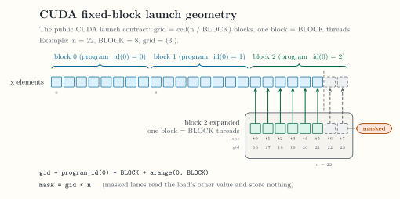

<!-- docs/reference/kernel-language.md -->

# Kernel Language

The current Python frontend accepts a restricted AST for fixed-block kernels.
This page lists that syntax. Anything not listed fails closed with a
source-located `CompilationError`. The narrower public execution shape has
exactly one floating vector addition or multiplication.

## When the check runs

`@swage.jit` rejects a function whose source is unavailable or does not
parse, a kernel name that is not an ASCII identifier, and a stacked
decorator. Everything else on this page is checked by `emit_mlir()`.
`launch()` checks the parameter list on every call and the body whenever it
compiles the kernel.

`emit_mlir()` checks the parameter list and the body before it imports the
native `mlir_swage` package. Without the bindings, as in a frontend-only
editable install, a kernel outside this page raises the same
`CompilationError` as it does with them. A kernel inside it raises a
`BackendUnavailableError` with the code `native-unavailable` that says the
check passed and names the
[Installation](../getting-started/installation.md) page. The released
`0.5.1` wheel predates this order, as that page states.

## The language module

`swage.language` is conventionally imported as `sl`, and this page writes
`sl.` throughout. The frontend recognizes the module by object, not by that
spelling:

- Any import name works. After `import swage.language as lang`, a kernel
  writes `lang.constexpr`, `lang.load(...)`, and so on.
- A different object bound to the name `sl` is not the language module.
- The marker and the four calls are written as attributes of a name bound
  to the module, such as `sl.load`. A bare `load` from
  `from swage.language import load` is rejected, and so is the dotted path
  `swage.language.load`.
- A kernel parameter that reuses the import name hides the module inside
  that kernel's body.
- An assignment in the body to the import name is rejected at the
  assignment.

## Function shape

- One `def` captured by `@swage.jit` or `@jit`.
- No stacked decorators.
- Ordinary positional parameters only. Positional-only, keyword-only,
  variadic positional, and variadic keyword parameters are rejected.
- No parameter default values. Every value is passed when the kernel is
  emitted or launched.
- Compile-time parameters carry the annotation `sl.constexpr`. Any other
  parameter annotation is rejected, including the string `"sl.constexpr"`.
- The return annotation `-> None` is accepted and changes nothing. Any other
  return annotation is rejected.
- A final empty `return` is optional. Return values and an earlier return are
  rejected.

Kernel bodies are parsed from source with `inspect.getsource`,
`textwrap.dedent`, and `ast.parse`. They do not execute as ordinary Python.

## Statements

The body accepts:

- an optional leading docstring;
- single-name assignment, such as `offsets = ...`;
- `sl.store(...)` as an expression statement;
- an optional final bare `return`.

Attribute targets, tuple unpacking, control flow, loops, comprehensions, and
other statement forms are unsupported.

## Expressions and operators

The accepted expression forms are:

- a bound name;
- an integer literal that fits signed 64-bit;
- `+` for index arithmetic, pointer plus offset vector, or two floating
  vectors with matching element types;
- `*` for index arithmetic or two floating vectors with matching element
  types;
- one signed less-than comparison between an index-offset vector and an i32
  or index value;
- one of the symbolic calls below.

Pointer values support only addition with an offset vector. An f32 vector
supports only `+` with another f32 vector. A float literal is accepted only
as the `other` value of `sl.load`. The frontend does not accept subtraction,
division, boolean operators, chained comparisons, attribute access as a
value, arbitrary calls, or Python control flow.

Index arithmetic is signed 64-bit and wraps at run time, where Python
integers do not. The frontend checks what it can know at compile time:

- When every operand of a `+` or `*` is an integer literal, an
  `sl.constexpr` value, an `sl.arange` lane, or a result of such operands,
  the frontend computes the range of the result and rejects a range that
  leaves signed 64-bit.
- A result that depends on `sl.program_id` is known only at run time and is
  not checked.

## Symbolic calls

```python
sl.program_id(axis_literal)
sl.arange(0, BLOCK)
sl.load(pointer + offsets, mask=mask, other=numeric_literal)
sl.store(pointer + offsets, value, mask=mask)
```

`program_id` requires one nonnegative integer literal that fits signed i32.
The public launch subset later requires axis zero. `arange` accepts only the
literal start `0` and the compile-time name `BLOCK`. `load` requires both
named arguments, and `store` requires its named mask. Keyword expansion and
duplicate keyword arguments are rejected.

The `other` value of `load` is an integer or float literal with an optional
leading minus sign, such as `0.0`, `-1.0`, or `-1`. It becomes an f32
constant:

- A float literal is rounded to the nearest float32. It is rejected when it
  is not finite, when it lies outside the float32 range, or when a nonzero
  literal rounds to zero.
- An integer literal is rejected unless float32 represents it exactly, so
  `16777216` is accepted and `16777217` is not.

`BLOCK` must be a positive signed 64-bit integer when present. Other
`sl.constexpr` values must be signed 64-bit integers. Vector operations
require `BLOCK`.

These calls compose into one logical launch geometry. The grid holds
`ceil(n / BLOCK)` logical programs of `BLOCK` lanes, and each program computes
`gid = program_id(0) * BLOCK + arange(0, BLOCK)`. The mask retires lanes at or
beyond `n`. CUDA maps those lanes to threads; Native CPU lowering executes the
admitted element range sequentially.

<div class="doc-figure" tabindex="0" markdown="1">



</div>

*The CUDA thread mapping for the fixed-block contract behind `program_id`,
`arange`, and masks. [Open the full-size figure](../assets/figures/fixed-block-thread-map.svg).*

## Supported value categories

The emitter tracks only i32 scalar parameters, index scalars, index vectors,
boolean vectors, floating vectors and pointer descriptors with element type
`f32`, `f16`, `f8E4M3FN`, or `f8E5M2`, and transient pointer-plus-offset
addresses. Floating addition, multiplication, and stores require matching
element types. A public launch kernel has exactly one floating `x + y` or
`x * y`; operation chains, floating vector/scalar arithmetic, broadcasting,
and matrix multiplication are outside the admitted execution shape.
It emits standard `arith`, `func`, `memref`, and `vector` operations around
the logical `swage.program_id` operation. See
[Dtypes and rounding](runtime-environment.md#dtypes-and-rounding) for the
numerical contract.

This language is the public fixed-block subset. The segment
operations present in native MLIR are not exposed as Python language symbols.
The two segmented calls on [swage](swage.md) run fixed segment programs and
take no kernel.
Continue with [Runtime and Environment](runtime-environment.md) for what a
launch validates and how a kernel is compiled, cached, and loaded. The call
contracts are on [swage](swage.md), and the native semantic IR boundary is
on [Swage Dialect](../internals/swage-dialect.md).
