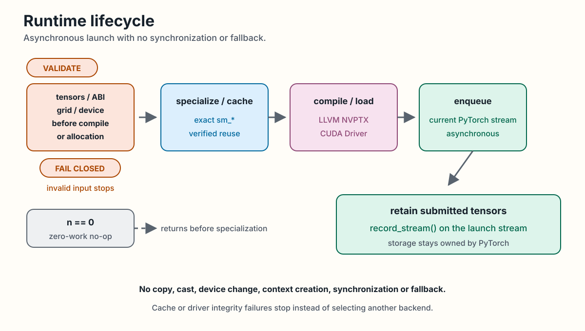
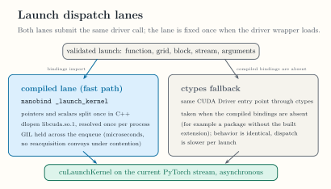
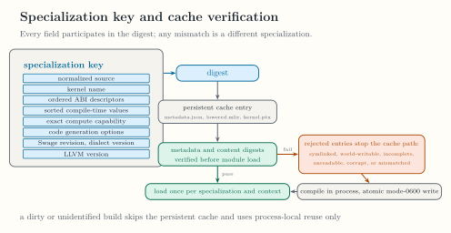

<!-- docs/reference/runtime-environment.md -->

# Runtime and Environment

The public runtime executes only canonical fixed vector add. Private
qualification reuses the same CUDA Driver wrapper for admitted segmented
modules. Both paths validate their complete host-visible boundary before
reading pointers, allocating private storage, compiling, or launching.

## Launch lifecycle

The public path requires three contiguous rank-one `torch.float32` CUDA
tensors on the current device. `n` is a nonnegative i32 no larger than any
tensor, `BLOCK` is a positive integer within the active device limit, and
`grid` must equal `(ceildiv(n, BLOCK),)`. Validation also checks the canonical
parameter names and ordered ABI before reading pointers or starting compiler
work.

For `n == 0`, the required grid is `(0,)`, and the validated launch returns
without compilation, cache access, module loading, or enqueue. Other launches
target the active device exactly and admit the NVPTX processors that the
pinned LLVM release defines, currently `sm_80`, `sm_86`, `sm_87`, `sm_88`,
`sm_89`, `sm_90`, `sm_100`, `sm_101`, `sm_103`, `sm_110`, `sm_120`, and
`sm_121`; a device below compute capability 8.0, or one the pinned release
does not define, is rejected during compilation. The runtime then
emits semantic MLIR, lowers and emits PTX in process through LLVM NVPTX, loads
the module through `libcuda.so.1`, and enqueues asynchronously on the current
PyTorch CUDA stream.

Swage does not invoke NVRTC or a subprocess compiler. It does not copy or
cast tensors, change devices, create a CUDA context, synchronize, or select a
fallback backend. Loaded functions are reused per specialization and CUDA
context. Tensor storage remains owned by PyTorch, and submitted tensors are
retained through `record_stream()`.

Validation fails closed before specialization, compilation, or private
allocation. Nonzero work specializes and checks the cache, then compiles and
loads when needed.

<div class="doc-figure" tabindex="0" markdown="1">



</div>

*The validated runtime lifecycle, including zero work and stream retention. [Open the full-size figure](../assets/diagrams/runtime-lifecycle.svg).*

Dispatch reaches the driver through a compiled entry point. The nanobind
`_launch_kernel` binding splits pointer and scalar arguments once in C++,
resolves `libcuda.so.1` with `dlopen` once per process, and deliberately
holds the GIL across the microsecond enqueue. When the compiled bindings
are absent, a ctypes path submits the same driver call with identical
behavior and a slower per-launch cost.

<div class="doc-figure" tabindex="0" markdown="1">



</div>

*The two launch dispatch lanes and when each is taken. [Open the full-size figure](../assets/figures/dispatch-path.svg).*

## Specialization and cache

The specialization key contains normalized source, kernel name, ordered ABI
descriptors, sorted compile-time values, exact compute capability, code
generation options, Swage revision, dialect version, and LLVM version.

An identified clean checkout with an LLVM pin may use the persistent cache.
A dirty or unidentified build uses process-local reuse only. The cache root is
selected in this order:

1. `SWAGE_CACHE_DIR`;
2. `$XDG_CACHE_HOME/swage`;
3. `~/.cache/swage`.

Each persistent entry contains `metadata.json`, `lowered.mlir`, and
`kernel.ptx`. Metadata and content digests are verified before module load.
Cache directories use user-only permissions; files use mode `0600` and are
replaced atomically. Symlinked, world-writable, incomplete, unreadable,
corrupt, or specialization-mismatched entries are rejected.

<div class="doc-figure" tabindex="0" markdown="1">



</div>

*Specialization key fields and the verify-or-reject cache path. [Open the full-size figure](../assets/figures/specialization-key-cache.svg).*

## Debug dumps

Set either dump switch to the string `1`:

```bash
export SWAGE_DUMP_MLIR=1
export SWAGE_DUMP_PTX=1
export SWAGE_DUMP_DIR=/path/to/output
```

The default dump directory is `swage-dumps` under the current directory.
Dump files are named by specialization digest and receive the same safe,
atomic write treatment as cache artifacts.

## Environment report

```bash
python -m swage.env
```

The command reports Swage and Python versions, platform, PyTorch version,
the CUDA version used to build PyTorch, actual CUDA driver version when
available, CUDA availability, GPU name and compute capability, repository
LLVM pin when discoverable, and package backend status. It exits cleanly when
optional components are absent and reports them as unavailable.

The package backend field describes what is built into the installed Python
package. It does not detect a separate build-tree `mlir_swage` package.

Continue with [Public Python API](public-python-api.md) for the public call
surface, [Troubleshooting](../getting-started/troubleshooting.md) for common
boundary failures, or [Verification Evidence](../qualification/evidence.md)
for the tests behind runtime claims.
