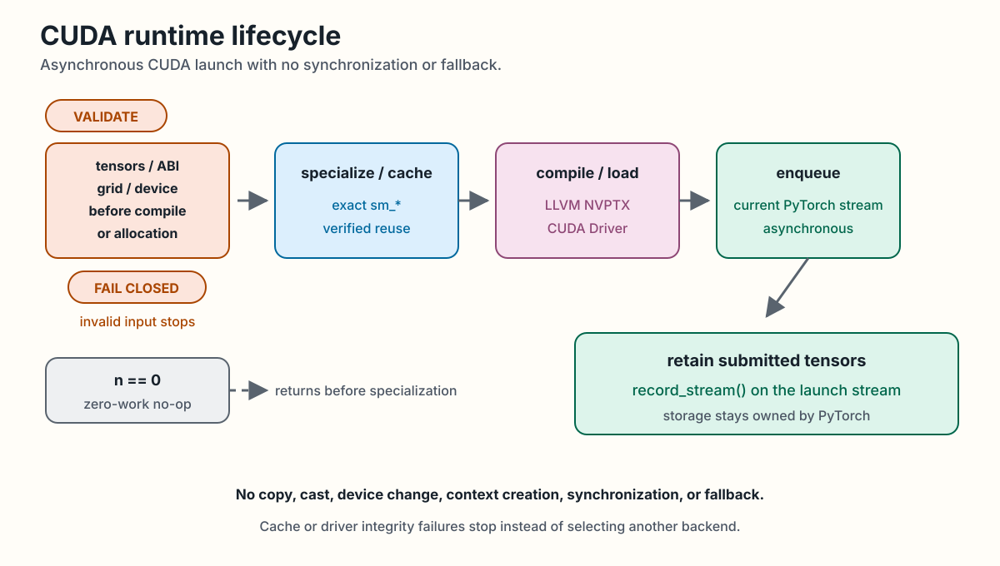
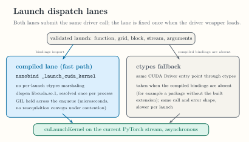
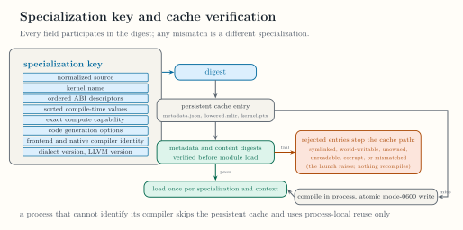

<!-- docs/reference/runtime-environment.md -->

# Runtime and Environment

The public runtime executes only canonical fixed vector add. Private
qualification reuses the same CUDA Driver wrapper for admitted segmented
modules. Both paths validate their complete host-visible boundary before
reading pointers, allocating private storage, compiling, or launching.

## Launch lifecycle

The public path requires three contiguous rank-one `torch.float32` CUDA
tensors on the current device. `n` is a nonnegative i32 no larger than any
tensor, `BLOCK` is a positive integer within the active device limit, and
`grid` must equal `(ceildiv(n, BLOCK),)`. Validation also checks the canonical
parameter names and ordered ABI before reading pointers or starting compiler
work.

The kernel reads and writes tensor storage through raw pointers, so three
more checks apply to the tensors:

- No tensor may be a lazy negation view or a lazy conjugate view
  (`is_neg()` or `is_conj()`). Such a view shares the storage of its base
  and shows different values, so the kernel would compute with the base.
  Pass `tensor.resolve_neg()` or `tensor.resolve_conj()`.
- The output must not share any byte with either input, including an output
  that is the same tensor as an input. The comparison uses the full extent
  of each tensor, not only the first `n` elements. The two inputs may share
  memory with each other. The check cannot see two virtual mappings of one
  physical allocation.
- No tensor may require grad. A launch records no gradient, so a result
  computed from such a tensor would be cut from the autograd graph without
  an error. Pass `tensor.detach()` to launch without gradients.

A launch requires PyTorch 2.6 or newer, the floor that the `pytorch` extra
declares, a `torch.Tensor.record_stream` method, and the
`torch.autograd.graph.increment_version` function. All three are checked
before validation, so an older PyTorch fails with a `RuntimeError` that
names the version found, and no kernel is compiled or enqueued. No newer
release is refused. Compile-only emission does not run this check.

For `n == 0`, the required grid is `(0,)`, and the validated launch returns
without compilation, cache access, module loading, or enqueue. Other launches
target the active device exactly and admit the NVPTX processors that the
pinned LLVM release defines, currently `sm_80`, `sm_86`, `sm_87`, `sm_88`,
`sm_89`, `sm_90`, `sm_100`, `sm_101`, `sm_103`, `sm_110`, `sm_120`, and
`sm_121`; a device below compute capability 8.0, or one the pinned release
does not define, is rejected during compilation. The
[Support Matrix](support-matrix.md) says which of these targets the GPU
tests execute on. The runtime then
emits semantic MLIR, lowers and emits PTX in process through LLVM NVPTX, loads
the module through `libcuda.so.1`, and enqueues asynchronously on the current
PyTorch CUDA stream.

Swage does not invoke NVRTC or a subprocess compiler. It does not copy or
cast tensors, change devices, create a CUDA context, or select a fallback
backend. A thread that has not used CUDA has no current context. A launch
on such a thread makes the context of the validated current device current
there, as the first PyTorch CUDA call on the thread would. That context is
the one PyTorch already holds for the device, so none is created, and a
context that is already current is never replaced. A launch of a kernel
that is already loaded does not synchronize.
A launch that loads a kernel can synchronize the context once;
[Module lifetime](#module-lifetime) states when. Loaded functions are reused
per specialization and CUDA context. Tensor storage remains owned by
PyTorch, and submitted tensors are retained through `record_stream()`.

Autograd sees neither what a kernel reads nor what it stores. Two rules keep
that from giving a wrong gradient without an error:

- A tensor that requires grad is rejected, as stated above.
- After the enqueue, a launch advances the version counter of its output
  through `torch.autograd.graph.increment_version`, as an in-place PyTorch
  operation does. A backward pass that saved the output before the launch
  then raises instead of using the overwritten values. The counters of the
  inputs are not advanced.

The private qualification helpers apply both rules to their values and
output. The advance changes host metadata only: it enqueues nothing and
does not wait for the device. It has two limits:

- A replayed CUDA graph runs no host code. The launch call that was
  captured advances the counter once, and a replay does not.
- An inference tensor has no version counter, so nothing is advanced for an
  output created under `torch.inference_mode()`.

Emitted kernels also pin their own launch width: the PTX carries a
`.reqntid` directive matching the specialized block size, so a launch
whose block dimension differs from the specialization fails at the driver
instead of running with the wrong geometry.

Validation fails closed before specialization, compilation, or private
allocation. Nonzero work specializes and checks the cache, then compiles and
loads when needed.

A `TypeError` or `ValueError` from a public launch keeps the message of the
check that failed and ends with the kernel and the place it is defined, as
in `grid must equal (2,) for n and BLOCK (in launch of kernel 'add_kernel',
defined at /path/to/kernels.py:12)`. A kernel whose parameter list has a
default value or an annotation other than `sl.constexpr` raises the
source-located `CompilationError` of the frontend before anything is
compiled. The private qualification helpers reject lazy negation and
conjugate views of their values, offsets, output, and task buffers in the
same way as the public launch. They also require the output to share no
memory with the values, the offsets, or caller-supplied task IDs.

A prepared private launch is bound to the storage it was prepared with. The
preparation records the data pointer, the element count, and the dtype of
the values, offsets, and output tensors, and each launch compares them
before anything is enqueued. In-place writes to values and output are fine
and are the way to reuse a prepared launch. A tensor that was rebound to
other storage, for example through `tensor.data = other`, raises a
`RuntimeError` that names the tensor, even when the new storage has the same
size, and the launch must be prepared again. PyTorch does not advance the
version counter for such a rebind, so the offsets check alone does not see
it. The comparison is host work only. It cannot see storage that was freed
and allocated again at the prepared address with the prepared count and
dtype.

<div class="doc-figure" tabindex="0" markdown="1">



</div>

*The validated runtime lifecycle, including zero work and stream retention. [Open the full-size figure](../assets/diagrams/runtime-lifecycle.svg).*

Dispatch reaches the driver through a compiled entry point. The nanobind
`_launch_kernel` binding builds the driver argument array without
per-launch ctypes marshaling, resolves `libcuda.so.1` with `dlopen` once
per process, and deliberately holds the GIL across the microsecond
enqueue. When the compiled bindings are absent, a ctypes path submits the
same driver call with the same error shape and a slower per-launch cost.

<div class="doc-figure" tabindex="0" markdown="1">



</div>

*The two launch dispatch lanes and when each is taken. [Open the full-size figure](../assets/figures/dispatch-path.svg).*

### Threads

A launch from several threads follows these rules:

- A launch of a kernel that the process has already compiled and loaded
  takes no lock. It reads the in-process caches and enqueues.
- The enqueue holds the GIL, as stated above.
- Compilation releases the GIL. While the native compiler lowers a kernel
  and emits PTX, other Python threads run.
- One process-wide lock serializes every compile and every load of a kernel
  that `launch()` or a private qualification helper starts. Two compiles
  therefore never run at the same time, and a compile on one thread does
  not delay a launch of a loaded kernel on another.
- The native binding also keeps two compiles off one MLIR context. A caller
  of the binding must not use a context from another thread while a compile
  of a module in that context runs.

### Interpreter exit and fork

The lock that serializes compiles and loads is held for a whole compile,
and the compiler runs without the GIL. Two process events need care:

- Interpreter exit. A daemon thread can be inside the compiler when the
  main thread ends, and a process that finalizes under a compile aborts or
  crashes. An exit handler therefore waits for the compile or load in
  flight and then keeps the lock, so that no other thread starts one. The
  wait is bounded at 5 seconds. A compile takes a few milliseconds, but the
  lock is also held while a load waits for the device, which nothing
  bounds, and a stuck thread must not hold the process open. After the
  bound the exit continues and the crash is possible again. A later exit
  handler that then needs a compile or a load gets a `RuntimeError` at
  once and does not wait again.
- Fork. A child forked while another thread compiles would inherit the lock
  in its taken state and wait for it forever at its first compile or load.
  `os.fork()` therefore waits for the compile or load in flight, and the
  parent and the child both release the lock. A fork taken on a thread
  that is itself compiling does not wait for itself.

These cases stay exposed:

- A compile that calls the native binding directly, without `launch()` or
  a private qualification helper, does not hold the lock. Exit and fork do
  not wait for it.
- `os._exit()`, a fatal signal, and a process that an embedding application
  tears down without running exit handlers skip the wait.
- A child forked from a process that has used CUDA cannot use CUDA. The
  fork handling covers the compiler and the caches, not the driver.

### Module lifetime

The process keeps compiled artifacts and loaded functions in two in-process
caches. Each keeps 128 entries. When one more entry is stored, the cache
forgets the entry it stored first, whether or not that kernel is still in
use. The next launch of a forgotten kernel reads it from the persistent
cache or compiles it, and loads it again. The private qualification helpers
keep caches of their own with the same bound.

A loaded CUDA module stays loaded for as long as something holds its
function handle: a cache entry, a prepared private launch, or a launch in
progress. Once nothing holds the handle, the module is queued for unloading.
The queue is emptied the next time the process loads a kernel in the same
CUDA context:

1. The context is synchronized once, so that launches of the queued modules
   that are still on a stream finish.
2. Each queued module is unloaded.

This is the only synchronization on the public path, and a launch of a
loaded kernel never reaches it. These rules bound it:

- A kernel that a public launch enqueues on a stream that is capturing a
  CUDA graph stays loaded for the rest of the process, because the graph
  can replay it at any time.
- A prepared private launch is not kept that way. The prepared object keeps
  its kernels loaded and must outlive every graph that captured it.
- A module of another CUDA context stays queued until that context is
  current.
- While the calling thread captures a CUDA graph, nothing is unloaded and
  the queue waits for a later load.
- A driver error during the synchronize or an unload is reported as one
  `RuntimeWarning` per load and is never raised, because the caller is
  loading an unrelated kernel. Every queued module is tried, and a module
  that was not unloaded stays queued for the next load, which synchronizes
  and tries again. When the warning filters turn warnings into errors, the
  report is written to standard error instead.

One limitation remains. A capture that is open on another thread cannot be
seen from the loading thread. If a load finds queued modules while another
thread captures a graph in the same context, the synchronize invalidates
that capture and fails, the modules stay queued, and the process warns
that it left `<count>` unused CUDA modules loaded. To avoid it, launch every
kernel once before any thread starts a capture, so that no kernel is loaded
while a capture is open.

## Specialization and cache

The specialization key contains normalized source, kernel name, ordered ABI
descriptors, sorted compile-time values, exact compute capability, code
generation options, frontend identity, native compiler identity, dialect
version, and LLVM version.

The two compiler identities are read from the files on disk, not from the
checkout they came from:

- Frontend identity is the SHA-256 digest of every Python source file in the
  installed `swage` package, taken in sorted name order. Only regular files
  count; names that start with a dot, dangling symlinks, and directories are
  skipped.
- Native compiler identity is the file name, size, and modification time of
  the nanobind extension and the `libSwagePythonCAPI` library in
  `mlir_swage/_mlir_libs`.

Editing a frontend file or rebuilding the native libraries therefore changes
the key, and entries written by the earlier compiler are no longer matched.
The native identity reads file metadata, not file contents: a library
replaced by one with the same name, size, and modification time is not
detected.

A process runs the code it loaded, and nothing records which bytes that was.
The persistent cache is therefore used only when the files on disk are known
to be the loaded code, which requires all of the following:

- The native bindings are found and at least one frontend source is found.
- Every frontend source file can be read.
- Every frontend source file and native library was last changed before the
  process started.
- The process start time is available from `/proc/self/stat`.

A file changed after the process started may differ from the code that was
loaded earlier, so the process neither reads nor publishes entries. The check
runs before the lookup and again before an entry is published, where the
files are also compared with the identity in the key. An edit or a rebuild
that lands during a compile is therefore not published under either key. The
checkout state is not part of the check: the cache does not require a git
checkout or a clean working tree.

The start time is read when `swage` is imported. A forked child therefore
inherits the start time of the process that imported the package and is not
judged by the later time of the fork. This covers `os.fork`, the
`multiprocessing` fork start method, and a fork server that preloaded
`swage`: when a file changed after the parent loaded the code, the child
neither reads nor publishes. A spawned child imports the package itself and
uses its own start time.

The check has these limits:

- A file written less than one clock tick (10 ms) before the process started
  counts as changed, because the start time has that resolution.
- A file system whose clock differs from the host clock, or a step of the
  host clock while the process runs, shifts the comparison by that amount.

The cache root is selected in this order:

1. `SWAGE_CACHE_DIR`;
2. `$XDG_CACHE_HOME/swage`;
3. `~/.cache/swage`.

Each persistent entry is a directory named by the key digest that contains
`metadata.json`, `lowered.mlir`, and `kernel.ptx`. Cache directories use
user-only permissions and files use mode `0600`.

Entries are published atomically. A writer stages the three files in a
`.staging-` directory inside the cache root and renames that directory to the
entry name, so a concurrent process sees either no entry or a complete one.
When several processes compile the same key, the first rename wins and the
other processes discard their staged copy and use the published entry. A
writer that is killed leaves only its staging directory, which lookups never
read.

Metadata and content digests are verified before module load. An entry
directory that lacks any of the three files is treated as a miss. It is
renamed aside and removed, unless another process completed it in the
meantime, and the key is compiled and published again. Symlinked,
world-writable, unreadable, corrupt, or specialization-mismatched entries,
entries not owned by the current user, and a regular file in place of an
entry directory are rejected with an error. These are treated as evidence of
tampering and always fail the launch.

A cache that cannot be used never fails a launch. When the identity check
does not pass, or the cache root cannot be inspected, created, or written,
the compiled kernel is kept and reused within the process, and one
`RuntimeWarning` per process names the file or directory and the cause. When
only writing fails, entries that are already published are still read. An
incomplete entry that cannot be removed from such a root stays a miss for its
own key and does not affect lookups of other keys.

<div class="doc-figure" tabindex="0" markdown="1">



</div>

*Specialization key fields and the verify-or-reject cache path. [Open the full-size figure](../assets/figures/specialization-key-cache.svg).*

### Cache bound

The cache root holds at most 1024 entries. After a process publishes an
entry, it removes the entries published longest ago until the root is within
the bound. The entry just published always stays. Reading an entry does not
renew it, so the order is the order of publication, taken from the
modification time of each entry directory. An entry of the fixed vector-add
kernel holds about 3 KB of data and occupies 16 KB on a file system with
4 KB blocks, so the default bound is about 16 MB there.

The same pass removes staging directories older than one hour, which only a
killed writer leaves behind.

Only a directory that the current user owns and whose name is an entry digest
or a staging name is removed. Other files and directories under the cache
root are never touched. An entry is renamed aside before it is deleted, so a
concurrent lookup finds a complete entry or a miss. An evicted key is
compiled and published again when it is next needed.

When an old entry cannot be removed, the process stops publishing, warns
once, and keeps reading published entries.

### Cache variables

Four environment variables configure the cache. They are read at each lookup
that the process cache does not answer.

| Variable | Values | Effect |
|---|---|---|
| `SWAGE_CACHE_DIR` | A directory path | Selects the cache root. |
| `SWAGE_CACHE_MAX_ENTRIES` | A positive integer; default `1024` | Sets the most entries the cache root holds after a publish. |
| `SWAGE_CACHE_READ_ONLY` | `1`, or `0` or unset | With `1`, the process reads published entries and never changes the cache root. |
| `SWAGE_NO_COMPILE` | `1`, or `0` or unset | With `1`, a kernel that is not cached raises instead of compiling. |

With `SWAGE_CACHE_READ_ONLY=1` a miss still compiles, and the kernel is kept
and reused within the process. The process does not create the cache root,
publish, remove an incomplete entry, or evict, and it does not warn about
any of these. Unsafe and corrupt entries are still rejected with an error.

With `SWAGE_NO_COMPILE=1` a launch is served from the process cache or from a
published entry. On a miss it raises a `RuntimeError` before the kernel is
emitted, compiled, loaded, or enqueued. The error names the kernel and either
the missing key and the cache root, or the reason the process does not read
the cache. A process in this mode never publishes. It still removes an
incomplete entry that it finds, so add `SWAGE_CACHE_READ_ONLY=1` for a
process that must not change the cache root. To prepare such a process,
launch each kernel once with the same block size, on the same device target,
with the same `swage` sources and native libraries, in a process that may
compile.

`SWAGE_NO_COMPILE=1` also stops the private qualification helpers. They keep
compiled kernels in the process only and never use the persistent cache, so
with the switch set they launch a kernel that the process already holds and
raise the same `RuntimeError` for any other. A process that starts with the
switch set therefore cannot run them. The host planning pass of a
preparation is not a kernel compile and still runs. `SWAGE_CACHE_DIR`,
`SWAGE_CACHE_MAX_ENTRIES`, and `SWAGE_CACHE_READ_ONLY` have no effect on the
private helpers.

A value other than the ones listed is an error, not a default. A mistyped
variable raises a `ValueError` that names it at the first lookup, before
anything is compiled.

## Debug dumps

Set either dump switch to the string `1`:

```bash
export SWAGE_DUMP_MLIR=1
export SWAGE_DUMP_PTX=1
export SWAGE_DUMP_DIR=/path/to/output
```

The default dump directory is `swage-dumps` under the current directory.
Dump files are named by specialization digest and receive the same safe,
atomic write treatment as cache artifacts.

## Environment report

```bash
python -m swage.env
```

The command reports the Swage version, checkout revision, and package file,
Python version, platform, PyTorch version, the CUDA version used to build
PyTorch, actual CUDA driver version when available, CUDA availability, GPU
name and compute capability, the qualification of the device target,
repository LLVM pin when discoverable, the LLVM version the native bindings
were linked against, the native extension file, backend status, and the
state of the persistent cache. It exits cleanly when optional components are
absent and reports them as unavailable.

With the build-tree bindings on the path, the report looks like this:

```text
swage: 0.5.1
revision: 0123456789ab
swage_file: /home/user/swage/python/swage/__init__.py
python: 3.13.13
platform: Linux-6.8.0-138-generic-x86_64-with-glibc2.35
torch: 2.12.0+cu130
torch_cuda_build: 13.0
cuda_driver: 13.0
cuda: True
gpu: {'name': 'NVIDIA RTX A6000', 'compute_capability': '8.6'}
target: sm_86 (qualified)
llvm_pin: llvmorg-22.1.8
llvm_linked: 22.1.8
mlir_swage_file: /home/user/swage/build/python_packages/mlir_swage/_mlir_libs/_swageDialectsNanobind.cpython-313-x86_64-linux-gnu.so
backends: {'mlir': 'available (linked LLVM 22.1.8)'}
cache_dir: /home/user/.cache/swage
cache: active (reads and writes; 12 of at most 1024 entries)
compile_on_miss: allowed
```

Five fields identify the code and the native build:

- `revision` is the abbreviated git HEAD of the checkout that `swage` was
  imported from, with `-dirty` appended when tracked files are modified. It
  is `None` outside a git checkout, for example in a wheel install.
- `swage_file` is the `__init__.py` that `swage` was imported from. It
  tells two checkouts, or a checkout and a wheel install, apart.
- `llvm_linked` is the LLVM version compiled into the `mlir_swage` extension.
  It comes from the native library, not from `cmake/llvm-version.txt`, and
  is `None` when the bindings cannot be imported or were built before they
  recorded a version.
- `mlir_swage_file` is the native extension that was loaded. `mlir_swage` is
  a namespace package with no file of its own, so the extension names the
  build tree. It is `None` when the bindings cannot be imported.
- `backends` records whether `mlir_swage` imports in the reporting process.
  It reads `available (linked LLVM <version>)` when the import succeeds and
  `unavailable (build-tree mlir_swage bindings not importable)` when it
  fails.

`cuda_driver` is the CUDA version that `libcuda.so.1` reports. It needs no
PyTorch, so a CPU-only PyTorch build beside an installed driver shows
`cuda: False` with a driver version. It is `None` when the library cannot be
loaded.

`target` is the NVPTX processor of the current CUDA device, followed by its
standing. It is `None` when PyTorch sees no CUDA device.

- `(qualified)`: the GPU tests execute on this target. Only `sm_86` is
  qualified, on one NVIDIA RTX A6000.
- `(admitted, not qualified)`: the compiler accepts the target and emits PTX
  for it, and no test has executed that PTX.
- `(not admitted)`: compilation rejects the target.

The [Support Matrix](support-matrix.md) uses the same three terms and adds
the Python, PyTorch, and driver versions that the tests run with.

Three fields describe the persistent cache as the reporting process would use
it. A process that started earlier, or that runs with other variables, can
differ.

- `cache_dir` is the cache root.
- `cache` reads `active (reads and writes; <count> of at most <bound>
  entries)` in the default mode and `active (reads only; <count> entries)`
  with `SWAGE_CACHE_READ_ONLY=1`. It reads `off (<reason>)` when the process
  compiles without the cache, `rejected (<reason>)` when the cache root is
  unsafe and every lookup raises, and `unknown (<error>)` when a cache
  variable has a value that a launch rejects.
- `compile_on_miss` reads `allowed`, or `refused (SWAGE_NO_COMPILE=1)`.

The report only reads. It does not create the cache root, remove anything
from it, or warn.

`llvm_pin` is the release tag in `cmake/llvm-version.txt` and `llvm_linked`
is a bare version, so a build against the pinned release shows
`llvmorg-22.1.8` and `22.1.8`. Any other pair means the bindings were built
against a different LLVM install than the repository pins.

Continue with the [Support Matrix](support-matrix.md) for the environments
these rules are tested in. Use
[Troubleshooting](../getting-started/troubleshooting.md) for common boundary
failures, or [Verification](../internals/verification.md) for the tests
behind runtime claims.
