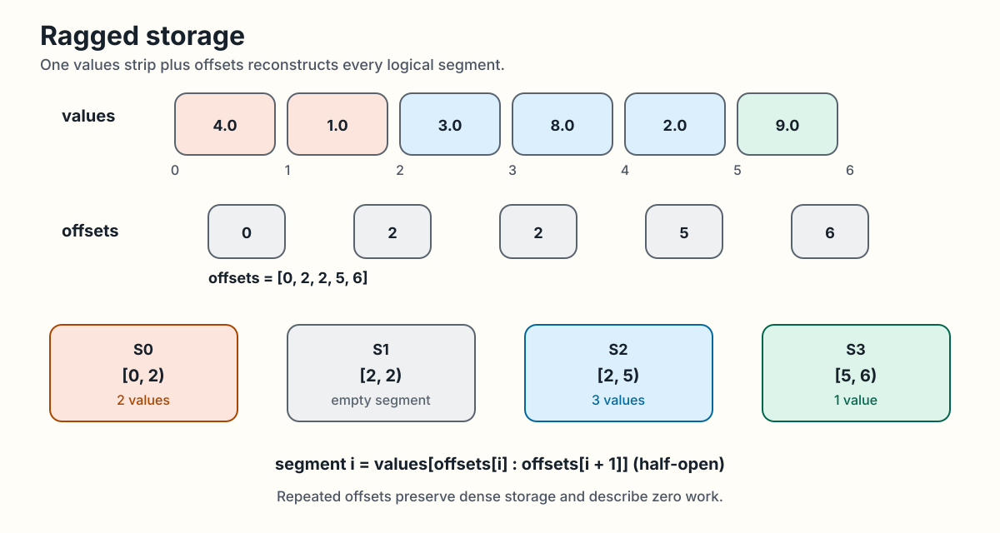

<!-- docs/user-guide/ragged-data.md -->

# Ragged Data

Variable-sized, internally dense segments appear in ragged softmax rows,
jagged batches, and graph neighborhoods. Fixed GPU work shapes handle
regular data well, but padding and one-shape scheduling waste work or
create load imbalance on ragged inputs. Everything in Swage grows from how
it stores and names this data.

Swage starts with ragged storage: one dense values buffer plus offsets that
divide it into logical segments. In the concrete example below, offsets
`[0, 2, 2, 5, 6]` describe ranges `[0, 2)`, `[2, 2)`, `[2, 5)`, and `[5, 6)`
over six dense values. The repeated offset makes the second segment empty.
Segment `i` is always the half-open slice
`values[offsets[i] : offsets[i + 1]]`; differing segment lengths do not add
padding or gaps to the values buffer.

<div class="doc-figure" tabindex="0" markdown="1">



</div>

*Dense ragged storage, including a repeated offset and empty segment. [Open the full-size figure](../assets/diagrams/ragged-storage.svg).*

## Why the separation matters

If a segment were treated as a fixed tile, short rows would be padded and
long rows would not fit. If a segment always became one task, tiny rows could
underuse a CTA and a very long row could dominate the launch tail. If GPU IDs
were part of semantic IR, changing the schedule would require rewriting the
kernel's meaning.

Swage instead preserves the segment-local meaning and allows task derivation
to be qualified separately. Today, that separation is public for canonical
fixed vector add and privately qualified for selected segmented modules.
General public segmented execution remains planned.

## Three questions, three levels

The rest of this guide follows one ladder of questions:

```text
Segment: What logical data and computation does one program instance mean?
    |
    v
Task:    What schedulable work is needed for the observed segment length?
    |
    v
Tile:    What fixed warp or CTA step executes that task?
```

A segment is runtime-sized. A task is derived work. A tile is a fixed
physical step. Keeping the levels separate prevents the runtime shape from
leaking into semantic types or hard-coding GPU indices into the program.

Continue with [Execution Model](execution-model.md) for the invariants
behind each level and the current qualification boundary, or jump ahead
to [Internals](../internals/index.md) for the machinery drawn in full.
