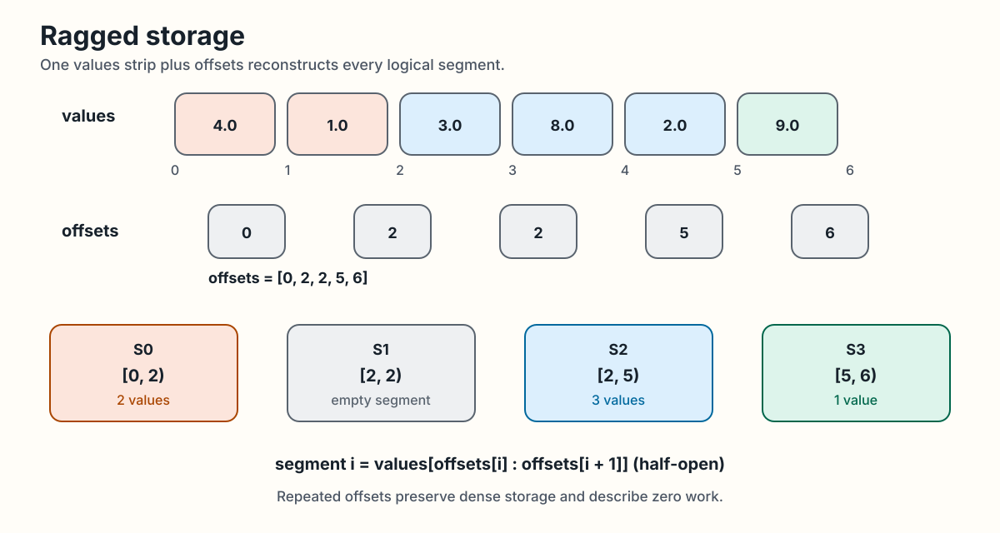

<!-- docs/user-guide/ragged-data.md -->

# Ragged Data

Variable-sized, internally dense segments appear in ragged softmax rows,
jagged batches, and graph neighborhoods. Fixed GPU work shapes handle
regular data well, but padding and one-shape scheduling waste work or
create load imbalance on ragged inputs. Everything in Swage grows from how
it stores and names this data.

Swage starts with ragged storage: one dense values buffer plus offsets that
divide it into logical segments. In the concrete example below, offsets
`[0, 2, 2, 5, 6]` describe ranges `[0, 2)`, `[2, 2)`, `[2, 5)`, and `[5, 6)`
over six dense values. The repeated offset makes the second segment empty.
Segment `i` is always the half-open slice
`values[offsets[i] : offsets[i + 1]]`; differing segment lengths do not add
padding or gaps to the values buffer.

<div class="doc-figure" tabindex="0" markdown="1">



</div>

*Dense ragged storage, including a repeated offset and empty segment. [Open the full-size figure](../assets/diagrams/ragged-storage.svg).*

## The offsets contract

The public calls `swage.segment_reduce` and `swage.segment_softmax`, which
[Segmented Calls](segmented-calls.md) introduces, and the private
qualification path behind them validate one contract. They check it on a
host copy of the offsets before they compile or launch anything. An input
that breaks a rule is rejected with an error. Nothing is cast, moved to
another device, or repaired. Both surfaces need the native build, PyTorch,
and `numpy`, which the binding requirements in
[Installation](../getting-started/installation.md) already include.

For `N` segments over one values buffer:

- `values` is a contiguous rank-one `torch.float32` tensor.
- `offsets` is a contiguous rank-one `torch.int32` tensor with `N + 1`
  entries.
- `offsets[0]` is zero.
- `offsets` never decreases. Two equal neighbors describe an empty segment.
- `offsets[N]` is at most the number of values. Values past it belong to no
  segment. `swage.segment_softmax` is stricter: `offsets[N]` must equal the
  number of values.
- The number of values and the number of segments are each below `2**31`.
- `values` does not require grad.
- For a GPU launch, both tensors are CUDA tensors on the current device.

The result tensor has the same basic rules on both surfaces: it is a
contiguous rank-one `torch.float32` tensor on the same device, it does not
overlap `values` or `offsets` in memory, and it does not require grad. Its
size differs:

- The public calls take an optional `out` with exactly `N` elements for a
  reduction and exactly one element per value for a softmax.
  [Segmented Calls](segmented-calls.md#arguments) states the rules.
- The private helpers take a required `output` with at least `N` elements
  for a reduction and at least `offsets[N]` elements for a softmax.

### Offsets of a prepared launch

The public calls and the private one-shot helpers `launch_gpu` and
`launch_softmax_gpu` validate the offsets on every call. A prepared launch,
which the private `_prepare_planned_reduction`, `_prepare_planned_sum`, and
`_prepare_persistent_sum` return, validates them once at preparation and
then launches the plan it built from that host copy. Two more rules apply
to its `offsets`:

- `offsets` is not an inference tensor. Offsets created under
  `torch.inference_mode()` are rejected at preparation with a `ValueError`,
  because an inference tensor has no version counter for the next rule to
  compare. Create the offsets outside the context, or clone them outside
  it. Offsets created under `torch.no_grad()` are admitted, and a launch
  may be prepared and run inside `torch.inference_mode()` with offsets that
  were created outside it. The public calls and the one-shot helpers keep
  no plan and compare no counter, so they accept inference tensors.
- `offsets` does not change after preparation. Each launch compares the
  version counter, data pointer, element count, and dtype of the tensor
  with the ones recorded at preparation, and raises a `RuntimeError` before
  anything is enqueued when one differs. Prepare again after changing the
  offsets. A public call launches what it prepared before it returns and
  keeps no plan, so this rule and its limits below concern the private
  prepared launches only.

The second rule is checked on the host through what PyTorch records, so the
check has these limits:

- A write that PyTorch does not count is not detected. The tests pin two
  such writes: an in-place write through `offsets.data`, such as
  `offsets.data.copy_(new)`, and a write through a DLPack alias of the
  tensor. A write through a raw pointer by another library or by another
  kernel is not counted either. The launch proceeds and reports nothing.
  Every access stays in bounds, because the kernels clamp each range they
  load to the buffer it indexes. The result is not a validated one: a
  segment that the plan runs as one task is reduced over the new offsets,
  and a segment that the plan split keeps the ranges recorded at
  preparation, so the output can mix the old and the new layout.
- A write to another view of the same tensor is refused although the
  offsets did not change, because every view of a tensor shares one version
  counter. Give the offsets a tensor of their own, for example with
  `clone()`.
- A replayed CUDA graph runs no host check. A replay after the offsets
  changed behaves as in the first case.

Assigning other storage to the tensor, as `offsets.data = other` does, is
not one of these limits: the data pointer changes, and the launch is
refused also when the new storage has the same size.

## Converting other layouts to offsets

The contract admits one layout. Each layout below is not admitted and needs
a conversion in PyTorch first:

- `int64` offsets: check that the final offset is below `2**31`, then cast
  with `offsets.to(torch.int32)`. The cast wraps silently if the check is
  skipped.
- Offsets without the final entry, as `torch.nn.EmbeddingBag` takes them:
  append the number of values.
- Offsets that start above zero, as a slice of a larger batch has them:
  subtract the first offset and pass the matching slice of the values.
- A lengths vector: prefix-sum it behind a leading zero.
- A sorted index vector, with one segment id per value in nondecreasing
  order: count the ids and prefix-sum the counts, as shown below.
- An unsorted index vector: sort the values by segment id first. There is no
  scatter form, so the sort and the gather are PyTorch work.

A sorted index vector, such as the batch vector of a graph mini-batch,
becomes offsets with PyTorch alone:

```python
import torch

# index[i] is the segment of values[i]: sorted, with ids in [0, 4).
index = torch.tensor([0, 0, 2, 2, 2, 3])
segment_count = 4

lengths = torch.bincount(index, minlength=segment_count)
offsets = torch.zeros(segment_count + 1, dtype=torch.int64)
offsets[1:] = torch.cumsum(lengths, dim=0)
assert int(offsets[-1]) < 2**31
offsets = offsets.to(torch.int32)  # tensor([0, 2, 2, 5, 6])
```

`minlength` keeps segments that have no values, so segment 1 stays in the
result as an empty segment. The result is the offsets example at the top of
this page. For an unsorted index, sort first and carry the values along:

```python
order = torch.argsort(index, stable=True)
values, index = values[order], index[order]
```

## Empty segments and NaN

The public calls and the private qualification path fix five results:

- The sum of an empty segment is `0.0`.
- The maximum of an empty segment is negative infinity.
- The maximum of a segment that contains a NaN is NaN.
- The minimum of an empty segment is positive infinity.
- The minimum of a segment that contains a NaN is NaN.

The tests pin all five. On PyTorch 2.12,
`torch.segment_reduce` returns the same values, and
`torch.nn.functional.embedding_bag` with `mode="max"` differs on the two
maximum results: it returns `0.0` for an empty bag and skips a NaN member. No option
changes the empty value. To get zero for empty segments, replace by length
after the call, not by value, because a segment whose values are all
negative infinity has the same maximum, and one whose values are all
positive infinity the same minimum:

```python
empty = offsets[1:] == offsets[:-1]
output = output.masked_fill(empty, 0.0)
```

An f32 sum has one more property that a caller should know: its rounding
depends on the schedule. [Execution Model](execution-model.md) introduces
that, and [Segmented Reductions](../internals/segmented-reductions.md)
states the bound, the evidence, what a sum does with NaN and infinities,
and the internal module shapes and ABIs behind this contract.

## Three questions, three levels

The rest of this guide follows one ladder of questions:

```text
Segment: What logical data and computation does one program instance mean?
    |
    v
Task:    What schedulable work is needed for the observed segment length?
    |
    v
Tile:    What fixed warp or CTA step executes that task?
```

A segment is runtime-sized. A task is derived work. A tile is a fixed
physical step. Keeping the levels separate prevents the runtime shape from
leaking into semantic types or hard-coding GPU indices into the program.

## Why the separation matters

If a segment were treated as a fixed tile, short rows would be padded and
long rows would not fit. If a segment always became one task, tiny rows could
underuse a CTA and a very long row could dominate the launch tail. If GPU IDs
were part of semantic IR, changing the schedule would require rewriting the
kernel's meaning.

Swage instead preserves the segment-local meaning and allows task derivation
to be qualified separately. Today two fixed segment programs, a reduction
and a softmax, are callable from Python. Other segment programs run only as
privately qualified native modules, and a public segment syntax remains
planned.

Continue with [Segmented Calls](segmented-calls.md), which runs the two
public functions on this storage. [Writing Kernels](writing-kernels.md) then
turns to the kernel language, which has no segment syntax, and
[Execution Model](execution-model.md) returns to segments, tasks, and tiles
and gives the invariants behind each level.
